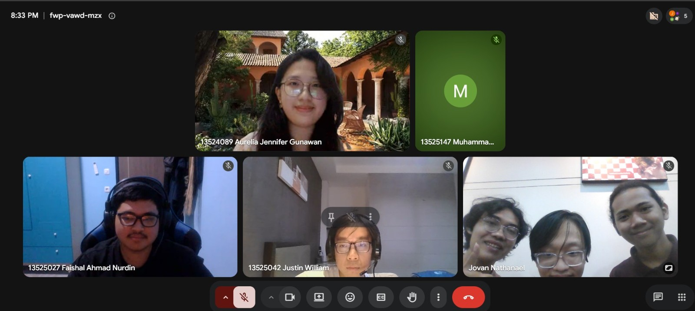

# Form Asistensi

## Tugas Besar IF2150 - Rekayasa Perangkat Lunak

| Informasi | Keterangan |
| --- | --- |
| **Hari** | Senin |
| **Tanggal** | 31/08/2026 |
| **Kelas** | K-03 |
| **Nomor Kelompok** | G-02 |
| **Nama Kelompok** | DapinKoding  |
| **Nama Perangkat Lunak** | *\[Nama P/L\]*  |
| **Dokumen** | [K03_G02_Template1_TB.md](./K03_G02_Template1_TB.md) |

### Anggota Kelompok

| NIM      | Nama                      |
| -------- | ------------------------- |
| 13525027 | Faishal Ahmad Nurdin      |
| 13525042 | Justin William            |
| 13525060 | M. Aqsha Bagus R.I.B.     |
| 13525087 | Jovan Nathanael           |
| 13525147 | Muhammad Dhafin Al Khairy |

### Catatan

| Catatan |
| --- |
| 1. Software boleh pake arsitektur apa aja selama bisa diimplementasi  |
| 2. Semua fiturnya harus ada sesuai dokumen |
| 3. Antar milestone terkait, kaitkan hasil kerjaan dari milestone ke milestone |
| 4. Pendanaan ga perlu didokumenkan, tapi misal reward pasti didokumenkan |
| 5. Latar belakang kaitin lagi dengan SDG di Indonesia, sumbernya cantumin |
| 6. Analisis kondisi bagian solusi saat ini ditegasin fiturnya apa yang belum ada |
| 7. Deskripsi perangkat lunak lebih specify pake platform apa |
| 8. Asumsi batasan tegasin lagi, kayak misal terkait pendanaan dan reward, tambahin yang terkait regulasi yang udah ada saat ini |
| 9. identifikasi aktor harus bikin interface buat 3 3 aktornya (kalo ga keberatan) |
| 10. banyak miss-nya di aktivitas -> ikutin templatenya aja |
| 11. deskripsi aktivitas itu kebutuhan pengguna awal bikin versi lebih rincinya |
| 12. model proses bisnis diperhatikan disesuaikan sama contoh, kasih link tempat pengerjaannya |
| 13. yang 2 jenis user report sama relawan bisa digabungin aja (keputusan bersama) |

<!-- **Notes for this section:**  
*Catatan dapat dituliskan dalam bentuk paragraf atau poin-poin, disesuaikan saja.* 

## Dokumentasi

<!--  -->

  

  <i>Gambar 1. Dokumentasi kegiatan asistensi 1.</i>

