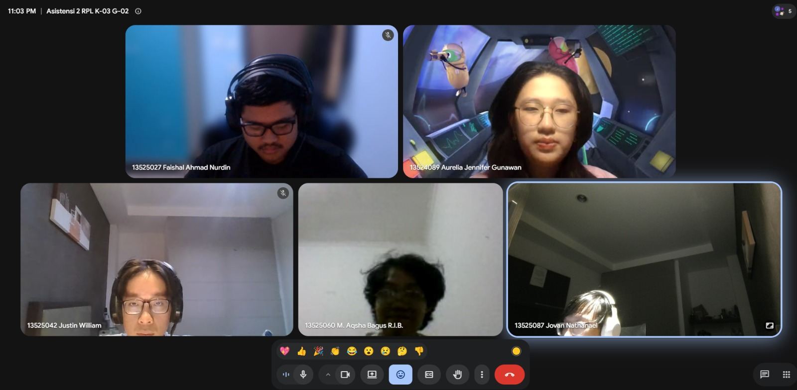

# Form Asistensi

## Tugas Besar IF2150 - Rekayasa Perangkat Lunak

| Informasi | Keterangan |
| --- | --- |
| **Hari** | Selasa |
| **Tanggal** | 08/09/2026 |
| **Kelas** | K-03 |
| **Nomor Kelompok** | G-02 |
| **Nama Kelompok** | DapinKoding  |
| **Nama Perangkat Lunak** | SoClean |
| **Dokumen** | *\[Nama Dokumen yang diasistensikan\]*  |

### Anggota Kelompok

| NIM      | Nama                      |
| -------- | ------------------------- |
| 13525027 | Faishal Ahmad Nurdin      |
| 13525042 | Justin William            |
| 13525060 | M. Aqsha Bagus R.I.B.     |
| 13525087 | Jovan Nathanael           |
| 13525147 | Muhammad Dhafin Al Khairy |

### Catatan

| Catatan |
| --- |
| 1. Deskripsi umum sistem bentuk abstrak dari perangkat lunak  |
| 2. Kebutuhan pengguna awal fokusin ke fitur utama, jadi login registrasi gitu technically karena masuk sistem (US-01, US-03) |
| 3. Deskripsi aktivitas keknya ada yg kegeser, atur-atur lagi |
| 4. Penukaran reward boleh ditambahin di aktivitas |
| 5. Nama aktivitasnya dimulai dari me- |
| 6. Fiksasi: melihat aja atau bisa memilih |
| 7. Pake format EARS |
| 8. Pemetaan kebutuhan, KF, disesuain sama aktivitas atau user story yang dihapus |
| 9. Aktivitas bisa ditambahin ga cuma dari aspek usernya |

**Notes for this section:**  
*Catatan dapat dituliskan dalam bentuk paragraf atau poin-poin, disesuaikan saja.* 

## Dokumentasi

<!--  -->

  

  <i>Gambar 1. Dokumentasi kegiatan asistensi.</i>

