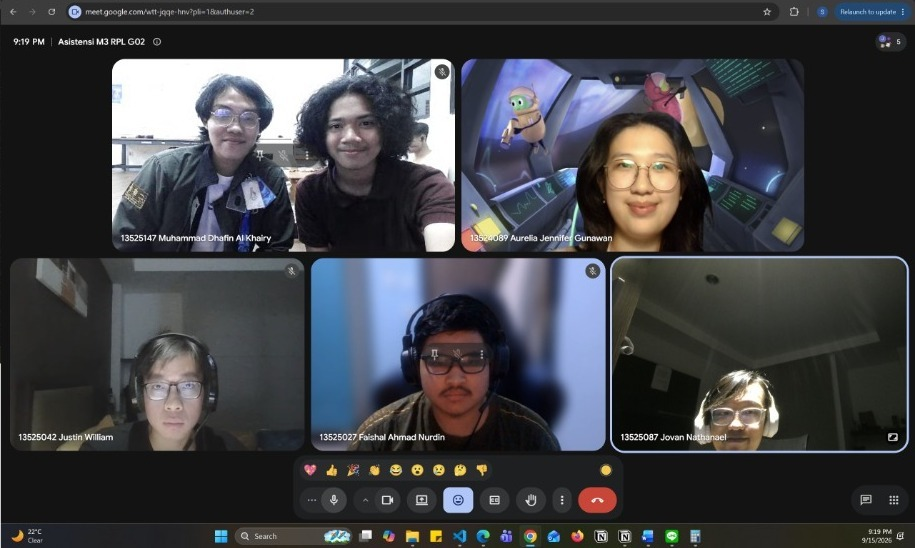

# Form Asistensi

## Tugas Besar IF2150 - Rekayasa Perangkat Lunak

| Informasi | Keterangan |
| --- | --- |
| **Hari** | Selasa |
| **Tanggal** | 08/09/2026 |
| **Kelas** | K-03 |
| **Nomor Kelompok** | G-02 |
| **Nama Kelompok** | DapinKoding  |
| **Nama Perangkat Lunak** | SoClean |
| **Dokumen** | K-03_G02_UC  |

### Anggota Kelompok

| NIM      | Nama                      |
| -------- | ------------------------- |
| 13525027 | Faishal Ahmad Nurdin      |
| 13525042 | Justin William            |
| 13525060 | M. Aqsha Bagus R.I.B.     |
| 13525087 | Jovan Nathanael           |
| 13525147 | Muhammad Dhafin Al Khairy |

### Catatan

| Catatan |
| --- |
| 1. *KF banyak detail implementasi. Preferably gk terlalu teknis. KF03 persoalan database bisa dihapus. KF04 seperti keputusan arsitektur/desain, bisa disimplifikasi aja. Kalimat teknis (database) mending dihapus aja. KF11 -> Penyesuaian jumlah poin pengguna*  |
| 2. *Use case diagram dirapiin, bisa pake draw.io* |
| 3. *UC07 BOLEH dipisah melihat saldo poin, daftar reward tersedia, sama penukaran reward* |
| 4. *Diagram pake nama Sistem SoClean (opsional)* |

**Notes for this section:**  
*Catatan dapat dituliskan dalam bentuk paragraf atau poin-poin, disesuaikan saja.* 

## Dokumentasi

<!--  -->

  

  <i>Gambar 1. Dokumentasi kegiatan asistensi.</i>

