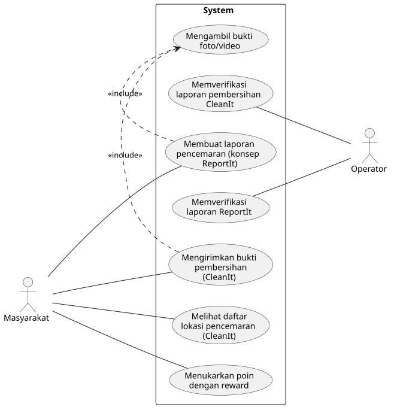

<h1>
IF2150 REKAYASA PERANGKAT LUNAK
 
TUGAS 3
 
USE CASE & SCENARIO USE CASE
</h1>
 

## _SoClean_

### Untuk: Aurelia Jennifer Gunawan

Dipersiapkan oleh:
| Informasi | Keterangan |
| --- | --- |
| Kelas | _K-03_ |
| Kelompok | _G-02_ |

| NIM      | Nama                      |
| -------- | ------------------------- |
| 13525027 | Faishal Ahmad Nurdin      |
| 13525042 | Justin William            |
| 13525060 | M. Aqsha Bagus R.I.B.     |
| 13525087 | Jovan Nathanael           |
| 13525147 | Muhammad Dhafin Al Khairy |

---

## Daftar Perubahan

| Revisi | Deskripsi |
| :--- | :--- |
| *A* | *Deskripsikan perubahan yang dilakukan dari dokumen sebelumnya pada dokumen ini. Jika tidak terdapat perubahan, harap kosongkan tabel.* |
| *B* |  |
| *C* |  |
| ... |  |

 
 

# BAB 1: Deskripsi Perangkat Lunak

SoClean adalah perangkat lunak berbasis *crowdsourcing* yang menyediakan sarana bagi publik untuk berkontribusi dalam upaya pelestarian lingkungan laut melalui pembersihan laut dari sampah-sampah domestik. Dalam implementasinya, perangkat lunak ini menggunakan metode gamifikasi yang kolaboratif sebagai bentuk dorongan komunal dalam usaha memajukan progres SDG ke-14.

Sebelum mendapatkan akses terhadap fitur-fitur di perangkat lunak, pengguna dapat melakukan registrasi serta *log in* menggunakan kredensial akunnya. Terdapat dua fitur utama dalam perangkat lunak ini: 1) laporan pembersihan sampah secara langsung (sementara disebut CleanIt), dan 2) laporan daerah penuh sampah (sementara disebut ReportIt). CleanIt merupakan fitur yang memungkinkan pengguna untuk melaporkan kontribusi langsungnya dalam membersihkan laut. Kontribusi tersebut dapat dikonfirmasi dengan mengunggah bukti, seperti foto atau video yang kemudian ditinjau oleh operator. Setelah hasil CleanIt-nya dinyatakan valid oleh operator, pengguna memperoleh poin untuk akunnya. ReportIt merupakan sarana bagi pengguna untuk melaporkan daerah lautan yang terkontaminasi sampah tanpa harus membersihkan secara langsung daerah tersebut. Pelaporan tersebut bersifat seperti *bounty* yang dapat diambil oleh pengguna lainnya untuk mendapatkan poin.

Perangkat lunak SoClean tersedia sebagai web app yang dapat digunakan oleh pengguna desktop maupun mobile.

<!-- Bagian ini boleh disalin dari 1.1 Deskripsi Umum Sistem pada dokumen *Requirement Gathering*. Pastikan isinya memang membahas deskripsi perangkat lunak kalian, seperti fitur, fungsi utama, dan cakupan sistem. -->

---

# BAB 2: Kebutuhan Fungsional (KF)

| ID KF | ID Kebutuhan | Penjelasan |
| :--- | :--- | :--- |
| *KF01* | *R01* | *Perangkat lunak dapat menampilkan antarmuka pembuatan laporan ketika pengguna memilih fitur ReportIt* |
| *KF02* | *R01* | *Perangkat lunak memiliki fitur untuk terhubung dengan kamera device dan mengambil foto yang disertai watermark dan timestamp ketika pengguna ingin mengambil bukti* |
| *KF03* | *R02* | *Perangkat lunak dapat mengecek kelengkapan laporan sebelum pengguna dapat mengirimkannya ke database server* |
| *KF04* | *R03* | *Perangkat lunak dapat terhubung dengan database untuk menyimpan informasi laporan dan object storage untuk menyimpan foto/video bukti yang dilampirkan pada laporan ketika dikirimkan oleh pengguna* |
| *KF05* | *R04* | *Perangkat lunak dapat menampilkan antarmuka daftar laporan pada database ketika operator ingin memverifikasi laporan* |
| *KF06* | *R06* | *Perangkat lunak dapat menampilkan daftar laporan yang telah diverifikasi ketika memilih fitur CleanIt* |
| *KF07* | *R06* | *Perangkat lunak dapat menampilkan antarmuka yang berisi informasi lengkap mengenai laporan (lokasi, waktu, sumber, bukti) ketika pengguna memilih laporan pada fitur CleanIt* |
| *KF08* | *R08* | *Perangkat lunak dapat menampilkan antarmuka pembuatan laporan bukti pembersihan ketika pengguna ingin melaporkan penyelesaian pembersihan* |
| *KF09* | *R11* | *Perangkat lunak dapat menampilkan antarmuka daftar penyelesaian pada database katika operator ingin memverifkasinya* |
| *KF10* | *R13* | *Perangkat lunak memberikan poin yang dapat ditukarkan dengan reward kepada pengguna setelah laporan pembersihan diverifikasi* |
| *KF11* | *R13* | *Perangkat lunak dapat terhubung dengan database yang menyimpan jumlah poin pengguna serta jumlah persediaan reward yang tersedia ketika terjadi penambahan atau pengurangan poin akibat ditukarkan* |
| *KF12* | *R15* | *Perangkat lunak dapat menampilkan antarmuka penukaran reward yang menampilkan jumlah poin pengguna dan reward yang tersedia untuk ditukarkan ketika pengguna memilih fitur penukaran* |

<!-- Salin ulang **seluruh Kebutuhan Fungsional (KF)** yang telah didefinisikan pada dokumen *Requirement Gathering*. Tabel ini menjadi acuan *traceability*, dimana setiap Use Case pada BAB 3 wajib ditelusuri ke satu atau lebih ID KF di tabel ini, dan sebaliknya setiap KF idealnya tercakup oleh minimal satu Use Case. Pastikan juga sudah menggunakan **format EARS** dalam penulisan KF.

| ID KF | Kebutuhan | Penjelasan |
| :--- | :--- | :--- |
| *KF01* | *Menampilkan pilihan metode pembayaran* | *Perangkat lunak dapat menampilkan pilihan antarmuka metode pembayaran (transfer bank, e-wallet, kartu kredit) setelah pengguna melakukan checkout.* |
| *KF02* | *Mengirim permintaan otorisasi pembayaran* | *Perangkat lunak dapat mengirimkan permintaan otorisasi transaksi ke API Payment Gateway beserta nominal tagihan dan ID Pesanan.* |
| *...* | *...* | *...* |

 ***Catatan***: *Jika ada KF dari ML2 yang berubah/bertambah/dihapus setelah asistensi, pastikan tabel ini konsisten dengan versi KF terbaru sebelum dikumpulkan.*

-->

---

# BAB 3: Model Use Case

## 3.1 Identifikasi Aktor
Daftarkan seluruh aktor yang terlibat dalam use case yang akan dimodelkan. Aktor berupa pengguna manusia yang berinteraksi dengan solusi. Perlu diperhatikan bahwa Admin/Developer/ Pihak Eksternal lain yang bisa diotomisasi, tidak perlu dijadikan aktor.

| Aktor   | Deskripsi                                                                                                                                                                                                                         |
| :------ | :-------------------------------------------------------------------------------------------------------------------------------------------------------------------------------------------------------------------------------- |
| Operator | _Pengguna ini bertindak sebagai pihak yang bertanggung jawab untuk memvalidasi laporan dari ReportIt dan CleanIt. Karakteristik dari pengguna ini adalah mengutamakan kecepatan untuk memverifikasi laporan dalam jumlah yang banyak._ |
| Masyarakat | _Pengguna ini bertindak sebagai pihak yang melaporkan pencemaran (Pelapor) maupun beraksi membersihkan sampah (Relawan) di ekosistem laut dan sungai. Karakteristik dari pengguna ini adalah mengutamakan kemudahan pelaporan dan melihat lokasi._ |

## 3.2 Identifikasi Use Case
<!-- Identifikasi seluruh use case yang mencakup Kebutuhan Fungsional pada BAB 2. Satu use case boleh mencakup lebih dari satu KF, dan sebaliknya satu KF boleh muncul di lebih dari satu use case bila memang relevan. -->

| ID UC | Nama Use Case | Deskripsi Singkat | Aktor Terlibat | ID KF Terkait |
| :--- | :--- | :--- | :--- | :--- |
| *UC01* | *Membuat Laporan Pencemaran (konsep ReportIt)* | *Masyarakat melaporkan lokasi perairan yang terkontaminasi sampah beserta bukti foto/video untuk diajukan ke Operator.* | *Masyarakat* | *KF01, KF03, KF04* |
| *UC02* | *Mengambil Bukti Foto/Video* | *Sistem menggunakan kamera device pengguna untuk mengambil foto/video bukti yang otomatis diberi watermark dan timestamp, digunakan sebagai lampiran pada laporan ReportIt maupun CleanIt.* | *Masyarakat* | *KF02* |
| *UC03* | *Memverifikasi Laporan ReportIt* | *Operator meninjau laporan pencemaran yang masuk beserta buktinya dan menentukan validitasnya agar laporan valid dapat ditampilkan sebagai bounty di peta.* | *Operator* | *KF05* |
| *UC04* | *Melihat Daftar Lokasi Pencemaran (CleanIt)* | *Masyarakat periksa daftar lokasi tercemar yang telah terverifikasi beserta detail informasinya (lokasi, waktu, sumber, bukti) sebelum memilih lokasi untuk dibersihkan.* | *Masyarakat* | *KF06, KF07* |
| *UC05* | *Mengirimkan Bukti Pembersihan (CleanIt)* | *Masyarakat yang telah membersihkan lokasi tercemar mengirimkan laporan penyelesaian beserta bukti foto/video pembersihan untuk diverifikasi Operator.* | *Masyarakat* | *KF08* |
| *UC06* | *Memverifikasi Laporan Pembersihan (CleanIt)* | *Operator meninjau laporan penyelesaian CleanIt yang masuk dan menentukan validitasnya. Apabila laporan valid, sistem memberikan poin reward ke akun Masyarakat terkait.* | *Operator* | *KF09, KF10, KF11* |
| *UC07* | *Menukarkan Poin dengan Reward* | *Masyarakat melihat saldo poin dan daftar reward yang tersedia, kemudian menukarkan poin yang dimiliki dengan reward yang dipilihnya* | *Masyarakat* | *KF11, KF12* |

## 3.3 Use Case Diagram
 

<i>Gambar 1. Use Case Diagram</i>

 

## 3.4 Skenario Use Case
Buat skenario untuk **setiap** use case yang telah diidentifikasi pada 3.2. Setiap skenario dapat terdiri dari dua jenis alur:
- **Skenario Normal**: alur utama (*happy path*) di mana interaksi aktor-sistem berjalan lancar tanpa kendala hingga tujuan use case tercapai.
- **Skenario Alternatif**: alur percabangan dari skenario normal, misalnya kondisi gagal, input tidak valid, atau pilihan lain yang tersedia bagi aktor. Boleh ada lebih dari satu skenario alternatif per use case jika ada beberapa titik percabangan berbeda.

Format tabel skenario: kolom **Aksi Aktor** berisi apa yang dilakukan/diinput aktor, kolom **Reaksi Perangkat Lunak** berisi respons sistem terhadap aksi tersebut secara **berurutan** (nomor langkah harus berpasangan/selaras antar dua kolom).

### 3.4.1 Skenario UC01

**Nama Use Case:** *Membuat Laporan Pencemaran*

**Skenario Normal**

| No | Aksi Aktor | Reaksi Perangkat Lunak |
| :--- | :--- | :--- |
| 1 | *Pengguna memilih menu ReportIt* | *Sistem menampilkan form pembuatan laporan* |
| 2 | *Pengguna mengisi informasi pada laporan* | *Sistem mengonfirmasi kecocokan informasi dengan format* |
| 4 | *Pengguna mengirimkan laporan* | *Sistem mengecek kelengkapan laporan, menampilkan notifikasi laporan dikirimkan, dan menampilkan instruksi untuk menunggu konfirmasi* |

 

**Skenario Alternatif 1: Informasi Tidak Sesuai Format**

| No | Aksi Aktor | Reaksi Perangkat Lunak |
| :--- | :--- | :--- |
| 1 | *Pengguna memilih menu ReportIt* | *Sistem menampilkan form pembuatan laporan* |
| 2 | *Pengguna mengisi informasi pada laporan* | *Sistem mengirimkan notifikasi bahwa informasi tidak sesuai dan menampilkan contoh format yang sesuai* |
| 3 | *Pengguna memperbaiki informasi pada laporan* | *Sistem mengonfirmasi kecocokan informasi dengan format* |
| 4 | *Pengguna mengirimkan laporan* | *Sistem mengecek kelengkapan laporan, menampilkan notifikasi laporan dikirimkan, dan menampilkan instruksi untuk menunggu konfirmasi* |

 

**Skenario Alternatif 2: Informasi Pada Laporan Tidak Lengkap**

| No | Aksi Aktor | Reaksi Perangkat Lunak |
| :--- | :--- | :--- |
| 1 | *Pengguna memilih menu ReportIt* | *Sistem menampilkan form pembuatan laporan* |
| 2 | *Pengguna mengisi informasi pada laporan* | *Sistem mengonfirmasi kecocokan informasi dengan format* |
| 3 | *Pengguna mengirimkan laporan* | *Sistem menampilkan notifikasi bahwa masih ada informasi yang belum diisi atau tidak lengkap dan menandakannya menggunakan penanda warna(?)* |
| 4 | *Pengguna melengkapi isi laporan* | *Sistem mengecek kelengkapan laporan, menampilkan notifikasi laporan dikirimkan, dan menampilkan instruksi untuk menunggu konfirmasi* |

### 3.4.2 Skenario UC02

**Nama Use Case:** *Mengambil Bukti Foto/Video*

**Skenario Normal**

| No | Aksi Aktor | Reaksi Perangkat Lunak |
| :--- | :--- | :--- |
| 1 | *Pengguna memilih menu pengambilan gambar* | *Sistem menampilkan antarmuka pengambilan gambar yang terdiri dari fitur kamera dan timestamp pada bagian kanan bawah* |
| 2 | *Pengguna menekan tombol pengambilan gambar* | *Perangkat akan mengambil foto/video yang disertai timestamp dan menyimpan hasilnya pada penyimpanan perangkat* |

 

**Skenario Alternatif 1: Penyimpanan Perangkat Penuh**

| No | Aksi Aktor | Reaksi Perangkat Lunak |
| :--- | :--- | :--- |
| 1 | *Pengguna memilih menu pengambilan gambar* | *Sistem menampilkan antarmuka pengambilan gambar yang terdiri dari fitur kamera dan timestamp pada bagian kanan bawah* |
| 2 | *Pengguna menekan tombol pengambilan gambar* | *Sistem menampilkan notifikasi bahwa penyimpanan perangkat penuh dan foto/video tidak tersimpan* |

### 3.4.3 Skenario UC03

**Nama Use Case:** *Memverifikasi Laporan ReportIt*

**Skenario Normal**

| No | Aksi Aktor | Reaksi Perangkat Lunak |
| :--- | :--- | :--- |
| 1 | *Operator memilih menu verifikasi laporan ReportIt* | *Sistem menampilkan daftar laporan yang belum diverifikasi* |
| 2 | *Operator memilih salah satu laporan ReportIt* | *Sistem menampilkan detail dan informasi laporan seperti bukti foto/video* |
| 3 | *Operator memeriksa validitas laporan* | *Sistem menampilkan pilihan untuk menyatakan valid/tidak* |
| 4 | *Operator menyatakan laporan valid* | *Sistem menyimpan status laporan sebagai valid dan menampilkan lokasi di laporan sebagai lokasi pencemaran yang dapat dipilih pada CleanIt* |

 

**Skenario Alternatif 1: Laporan Tidak Valid**

| No | Aksi Aktor | Reaksi Perangkat Lunak |
| :--- | :--- | :--- |
| 1 | *Operator memilih menu verifikasi laporan ReportIt* | *Sistem menampilkan daftar laporan yang belum diverifikasi* |
| 2 | *Operator memilih salah satu laporan ReportIt* | *Sistem menampilkan detail dan informasi laporan seperti bukti foto/video* |
| 3 | *Operator memeriksa validitas laporan* | *Sistem menampilkan pilihan untuk menyatakan valid/tidak* |
| 4 | *Operator menyatakan laporan tidak valid* | *Sistem menyimpan status laporan sebagai tidak valid dan tidak menampilkan lokasi di daftar lokasi untuk dibersihkan* |

### 3.4.4 Skenario UC04

**Nama Use Case:** *Melihat Daftar Lokasi Pencemaran (CleanIt)*

**Skenario Normal**

| No | Aksi Aktor | Reaksi Perangkat Lunak |
| :--- | :--- | :--- |
| 1 | *Pengguna memilih fitur CleanIt* | *Sistem menampilkan daftar lokasi pencemaran yang telah diverifikasi* |
| 2 | *Pengguna memilih salah satu lokasi* | *Sistem menampilkan informasi lengkap terkait lokasi tersebut* |
| 3 | *Pengguna memilih lokasi untuk dibersihkan* | *Sistem menampilkan konfirmasi bahwa lokasi tersebut dipilih untuk dibersihkan* |

 

**Skenario Alternatif 1: Tidak Ada Lokasi Pencemaran di Daftar**

| No | Aksi Aktor | Reaksi Perangkat Lunak |
| :--- | :--- | :--- |
| 1 | *Pengguna memilih fitur CleanIt* | *Sistem tidak menemukan lokasi pencemaran yang telah diverifikasi* |
| 2 | - |  *Sistem menampilkan notifikasi bahwa belum terdapat lokasi pencemaran yang tersedia untuk dibersihkan* |

### 3.4.5 Skenario UC05

**Nama Use Case:** *Mengirimkan Bukti Pembersihan (CleanIt)*

**Skenario Normal**

| No | Aksi Aktor | Reaksi Perangkat Lunak |
| :--- | :--- | :--- |
| 1 | *Pengguna memilih menu CleanIt* | *Sistem menampilkan antarmuka untuk mengirimkan bukti pembersihan* |
| 2 | *Pengguna mengisi informasi bukti pembersihan* | *Sistem mengonfirmasi kecocokan informasi dengan format yang benar* |
| 3 | *Pengguna mengirimkan bukti pembersihan* | *Sistem menyimpan bukti pembersihan dan memberikan konfirmasi kepada pengguna* |

 

**Skenario Alternatif 1: Pengiriman Bukti Pembersihan Gagal (misal: file terlalu besar)**

| No | Aksi Aktor | Reaksi Perangkat Lunak |
| :--- | :--- | :--- |
| 1 | *Pengguna memilih menu CleanIt* | *Sistem menampilkan antarmuka untuk mengirimkan bukti pembersihan* |
| 2 | *Pengguna mengisi informasi bukti pembersihan* | *Sistem mengonfirmasi kecocokan informasi dengan format yang benar* |
| 3 | *Pengguna mengirimkan bukti pembersihan* | *Sistem menampilkan notifikasi bahwa pengiriman bukti pembersihan gagal* |

### 3.4.6 Skenario UC06

**Nama Use Case:** *Memverifikasi Laporan Pembersihan (CleanIt)*

**Skenario Normal**

| No | Aksi Aktor | Reaksi Perangkat Lunak |
| :--- | :--- | :--- |
| 1 | *Operator membuka menu untuk melihat laporan masuk* | *Sistem menampilkan daftar laporan pembersihan yang masuk* |
| 2 | *Operator memilih laporan untuk diperiksa* | *Sistem menampilkan detail laporan pembersihan* |
| 3 | *Operator menyetujui laporan* | *Sistem menyimpan perubahan dan memberikan poin ke akun pengguna* |

 

**Skenario Alternatif 1: Operator menolak laporan karena bukti tidak sah**

| No | Aksi Aktor | Reaksi Perangkat Lunak |
| :--- | :--- | :--- |
| 1 | *Operator membuka menu untuk melihat laporan masuk* | *Sistem menampilkan daftar laporan pembersihan yang masuk* |
| 2 | *Operator memilih laporan untuk diperiksa* | *Sistem menampilkan detail laporan pembersihan* |
| 3 | *Operator menolak laporan karena bukti tidak sah dan mengisi alasan* | *Sistem menyimpan perubahan dan dan mengirimkan notifikasi alasan penolakan kepada pengguna* |

### 3.4.7 Skenario UC07

**Nama Use Case:** *Menukarkan Poin dengan Reward*

**Skenario Normal**

| No | Aksi Aktor | Reaksi Perangkat Lunak |
| :--- | :--- | :--- |
| 1 | *Pengguna memilih hadiah untuk diklaim* | *Sistem melakukan pengecekan terhadap jumlah poin pengguna dan harga poin hadiah* |
| 2 | *-* | *Apabila jumlah poin pengguna dan harga poin hadiah sesuai, poin pengguna dipotong dan hadiah diklaim oleh pengguna* |

 

**Skenario Alternatif 1: Poin tidak cukup**

| No | Aksi Aktor | Reaksi Perangkat Lunak |
| :--- | :--- | :--- |
| 1 | *Pengguna memilih hadiah untuk diklaim* | *Sistem melakukan pengecekan terhadap jumlah poin pengguna dan harga poin hadiah* |
| 2 | *-* | *Sistem mengirimkan notifikasi gagal mengklaim produk akibat jumlah poin yang kurang* |

*Lanjutkanlah pola 3.4.x ini untuk setiap ID UC yang telah diidentifikasi pada 3.2, sampai seluruh use case memiliki skenario normal dan skenario alternatif (tidak usah dibuat jika use case tersebut memang tidak memiliki skenario alternatif).*
