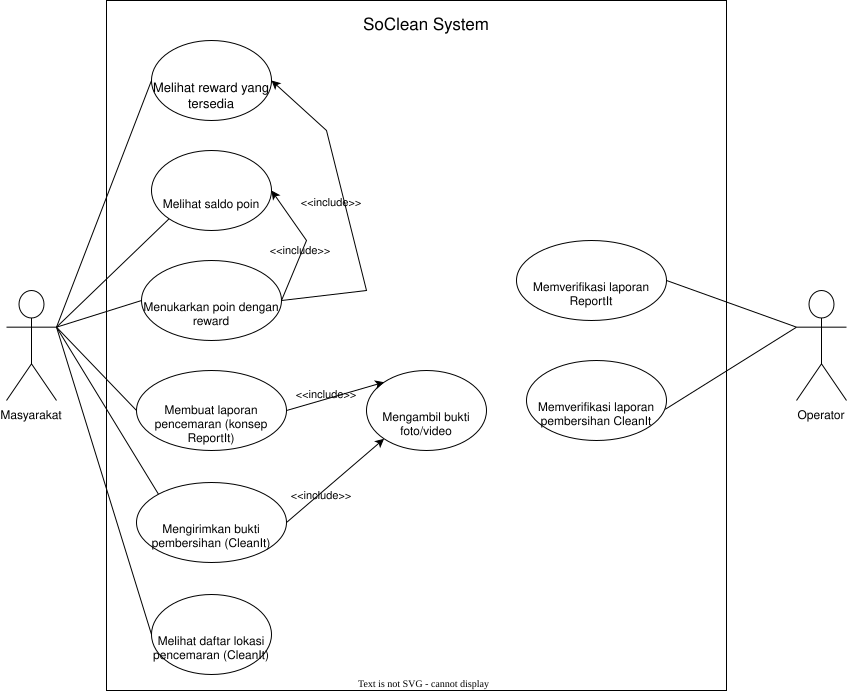
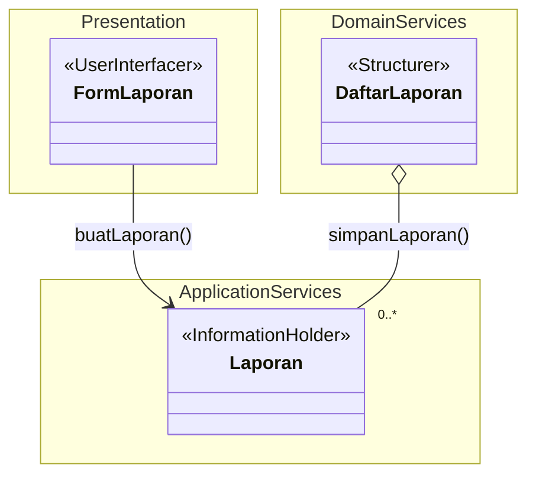
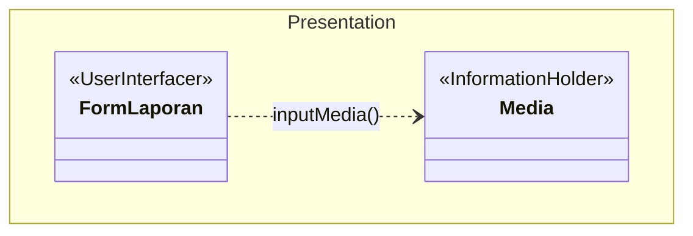
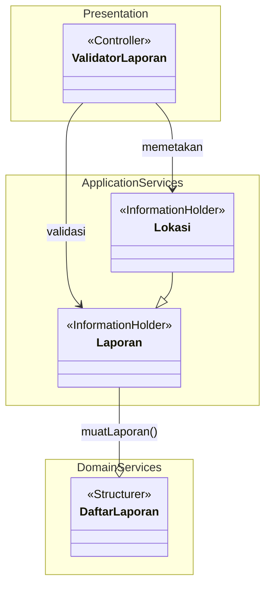
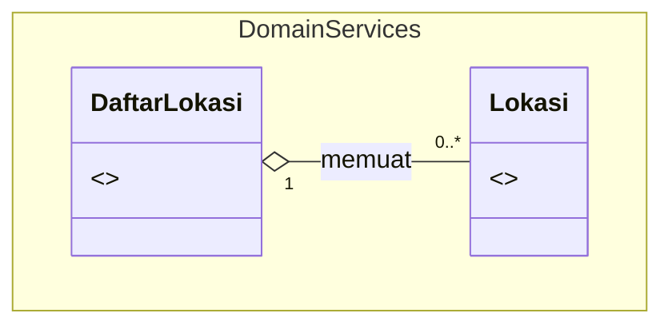
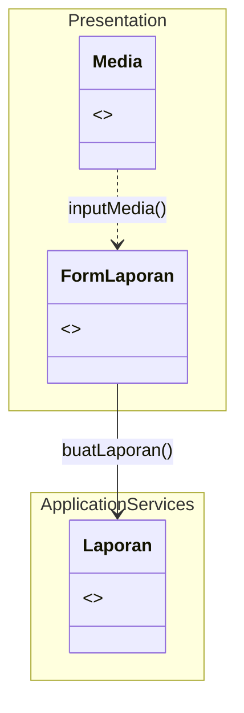
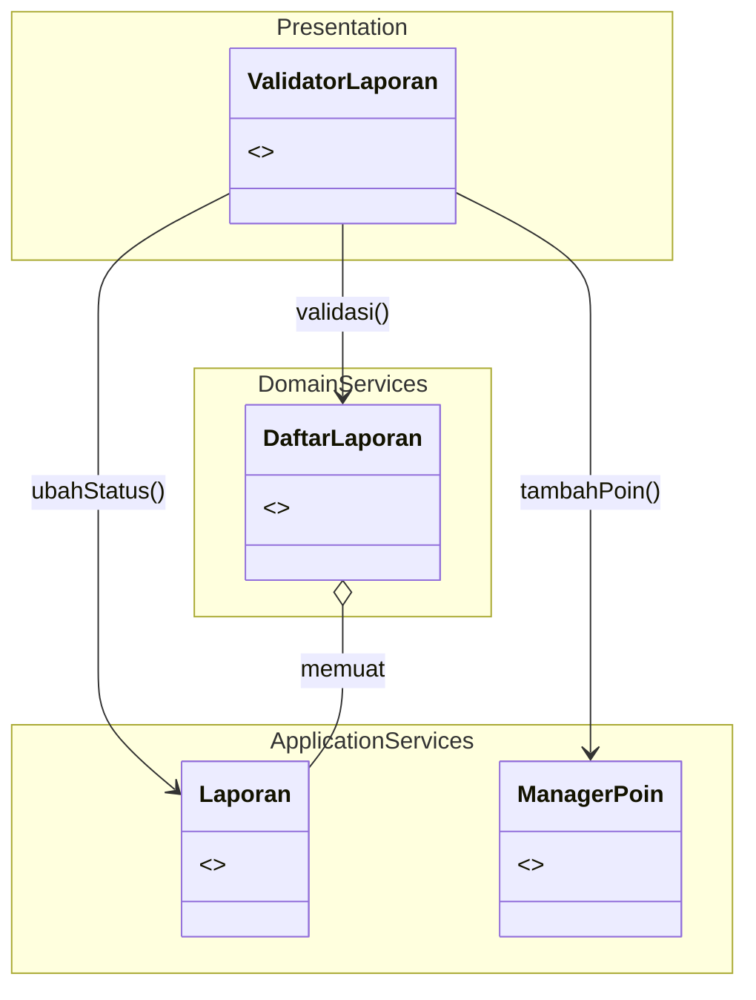
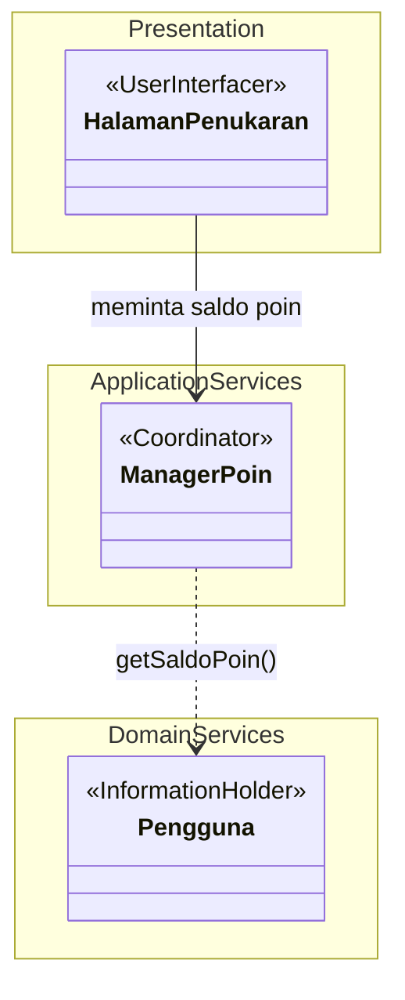
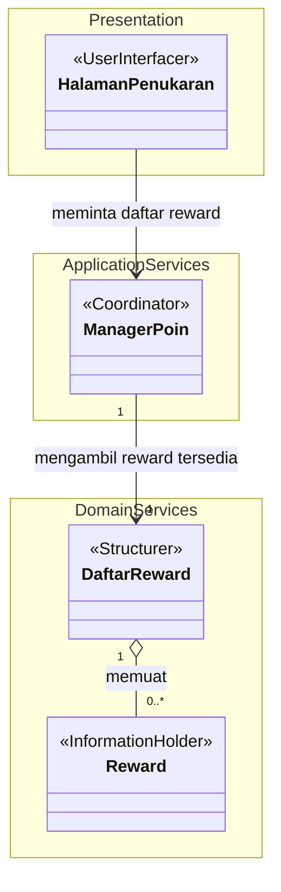
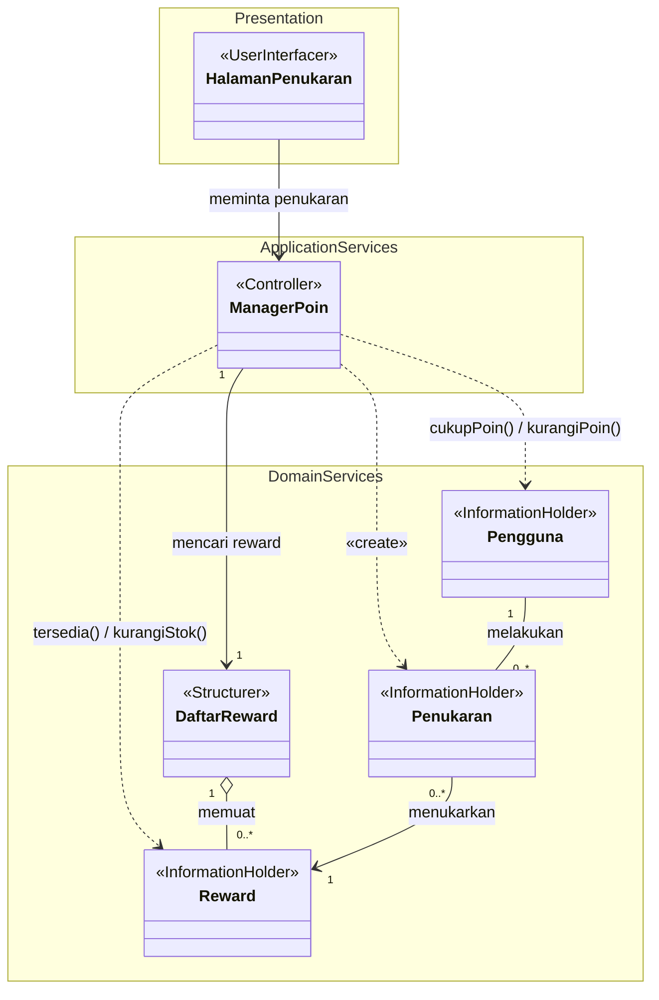

<h1>
IF2150 REKAYASA PERANGKAT LUNAK
 
TUGAS 4
 
CLASS DIAGRAM
</h1>
 

## *SoClean*

### Untuk: *Aurelia Jennifer Gunawan*

Dipersiapkan oleh:
| Informasi | Keterangan |
| --- | --- |
| Kelas | *K-03* |
| Kelompok | *G-02*  |

| NIM | Nama |
|---|---|
| 13525027 | Faishal Ahmad Nurdin      |
| 13525042 | Justin William            |
| 13525060 | M. Aqsha Bagus R.I.B.     |
| 13525087 | Jovan Nathanael           |
| 13525147 | Muhammad Dhafin Al Khairy |
---

## Daftar Perubahan

| Revisi | Deskripsi |
| :--- | :--- |
| *A* |  |
| *B* |  |
| *C* |  |
| ... |  |

 
 

# BAB 1: Deskripsi Perangkat Lunak

SoClean adalah perangkat lunak berbasis *crowdsourcing* yang menyediakan sarana bagi publik untuk berkontribusi dalam upaya pelestarian lingkungan laut melalui pembersihan laut dari sampah-sampah domestik. Dalam implementasinya, perangkat lunak ini menggunakan metode gamifikasi yang kolaboratif sebagai bentuk dorongan komunal dalam usaha memajukan progres SDG ke-14.

Sebelum mendapatkan akses terhadap fitur-fitur di perangkat lunak, pengguna dapat melakukan registrasi serta *log in* menggunakan kredensial akunnya. Terdapat dua fitur utama dalam perangkat lunak ini: 1) laporan pembersihan sampah secara langsung (sementara disebut CleanIt), dan 2) laporan daerah penuh sampah (sementara disebut ReportIt). CleanIt merupakan fitur yang memungkinkan pengguna untuk melaporkan kontribusi langsungnya dalam membersihkan laut. Kontribusi tersebut dapat dikonfirmasi dengan mengunggah bukti, seperti foto atau video yang kemudian ditinjau oleh operator. Setelah hasil CleanIt-nya dinyatakan valid oleh operator, pengguna memperoleh poin untuk akunnya. ReportIt merupakan sarana bagi pengguna untuk melaporkan daerah lautan yang terkontaminasi sampah tanpa harus membersihkan secara langsung daerah tersebut. Pelaporan tersebut bersifat seperti *bounty* yang dapat diambil oleh pengguna lainnya untuk mendapatkan poin.

Perangkat lunak SoClean tersedia sebagai web app yang dapat digunakan oleh pengguna desktop maupun mobile.

---

# BAB 2: Kebutuhan Fungsional

## 2.1 Kebutuhan Fungsional

Tabel 2.1. Daftar Kebutuhan Fungsional

| ID KF | ID Kebutuhan | Penjelasan |
| :--- | :--- | :--- |
| *KF01* | *R01* | *Perangkat lunak dapat menampilkan antarmuka pembuatan laporan ketika pengguna memilih fitur ReportIt* |
| *KF02* | *R01* | *Perangkat lunak memiliki fitur untuk terhubung dengan kamera device dan mengambil foto yang disertai watermark dan timestamp ketika pengguna ingin mengambil bukti* |
| *KF03* | *R02* | *Perangkat lunak dapat mengecek kelengkapan laporan sebelum pengguna dapat mengirimkannya* |
| *KF04* | *R03* | *Perangkat lunak dapat menyimpan informasi laporan dan foto/video bukti yang dilampirkan pada laporan ketika dikirimkan oleh pengguna* |
| *KF05* | *R04* | *Perangkat lunak dapat menampilkan antarmuka daftar laporan ketika operator ingin memverifikasi laporan* |
| *KF06* | *R06* | *Perangkat lunak dapat menampilkan daftar laporan yang telah diverifikasi ketika memilih fitur CleanIt* |
| *KF07* | *R06* | *Perangkat lunak dapat menampilkan antarmuka yang berisi informasi lengkap mengenai laporan (lokasi, waktu, sumber, bukti) ketika pengguna memilih laporan pada fitur CleanIt* |
| *KF08* | *R08* | *Perangkat lunak dapat menampilkan antarmuka pembuatan laporan bukti pembersihan ketika pengguna ingin melaporkan penyelesaian pembersihan* |
| *KF09* | *R11* | *Perangkat lunak dapat menampilkan antarmuka daftar penyelesaian katika operator ingin memverifkasinya* |
| *KF10* | *R13* | *Perangkat lunak memberikan poin yang dapat ditukarkan dengan reward kepada pengguna setelah laporan pembersihan diverifikasi* |
| *KF11* | *R13* | *Perangkat lunak dapat menyesuaikan jumlah poin pengguna serta jumlah persediaan reward yang tersedia ketika terjadi penambahan atau pengurangan* |
| *KF12* | *R15* | *Perangkat lunak dapat menampilkan antarmuka penukaran reward yang menampilkan jumlah poin pengguna dan reward yang tersedia untuk ditukarkan ketika pengguna memilih fitur penukaran* |
| *KF13* | *R15* | *Perangkat lunak dapat menukarkan koin dengan reward yang tersedia ketika pengguna mengonfirmasi penukaran* |

---

# BAB 3: Model Use Case

## 3.1 Identifikasi Aktor

| Aktor   | Deskripsi                                                                                                                                                                                                                         |
| :------ | :-------------------------------------------------------------------------------------------------------------------------------------------------------------------------------------------------------------------------------- |
| Operator | _Pengguna ini bertindak sebagai pihak yang bertanggung jawab untuk memvalidasi laporan dari ReportIt dan CleanIt. Karakteristik dari pengguna ini adalah mengutamakan kecepatan untuk memverifikasi laporan dalam jumlah yang banyak._ |
| Masyarakat | _Pengguna ini bertindak sebagai pihak yang melaporkan pencemaran (Pelapor) maupun beraksi membersihkan sampah (Relawan) di ekosistem laut dan sungai. Karakteristik dari pengguna ini adalah mengutamakan kemudahan pelaporan dan melihat lokasi._ |

## 3.2 Identifikasi Use Case

Use case berfungsi untuk mendeskripsikan interaksi aktor-aktor yang terlibat dengan sistem. Isi daftar use case dan deskripsi singkatnya dalam tabel di bawah.

Pada bagian ini, Anda diperbolehkan untuk menyalin dari dokumen sebelumnya.

| ID UC | Nama Use Case | Deskripsi Singkat | Aktor Terlibat | ID KF Terkait |
| :--- | :--- | :--- | :--- | :--- |
| *UC01* | *Membuat Laporan Pencemaran (konsep ReportIt)* | *Masyarakat melaporkan lokasi perairan yang terkontaminasi sampah beserta bukti foto/video untuk diajukan ke Operator.* | *Masyarakat* | *KF01, KF03, KF04* |
| *UC02* | *Mengambil Bukti Foto/Video* | *Sistem menggunakan kamera device pengguna untuk mengambil foto/video bukti yang otomatis diberi watermark dan timestamp, digunakan sebagai lampiran pada laporan ReportIt maupun CleanIt.* | *Masyarakat* | *KF02* |
| *UC03* | *Memverifikasi Laporan ReportIt* | *Operator meninjau laporan pencemaran yang masuk beserta buktinya dan menentukan validitasnya agar laporan valid dapat ditampilkan sebagai bounty di peta.* | *Operator* | *KF05* |
| *UC04* | *Melihat Daftar Lokasi Pencemaran (CleanIt)* | *Masyarakat periksa daftar lokasi tercemar yang telah terverifikasi beserta detail informasinya (lokasi, waktu, sumber, bukti) sebelum memilih lokasi untuk dibersihkan.* | *Masyarakat* | *KF06, KF07* |
| *UC05* | *Mengirimkan Bukti Pembersihan (CleanIt)* | *Masyarakat yang telah membersihkan lokasi tercemar mengirimkan laporan penyelesaian beserta bukti foto/video pembersihan untuk diverifikasi Operator.* | *Masyarakat* | *KF08* |
| *UC06* | *Memverifikasi Laporan Pembersihan (CleanIt)* | *Operator meninjau laporan penyelesaian CleanIt yang masuk dan menentukan validitasnya. Apabila laporan valid, sistem memberikan poin reward ke akun Masyarakat terkait.* | *Operator* | *KF09, KF10, KF11* |
| *UC07* | *Melihat Saldo Poin* | *Masyarakat melihat saldo poin* | *Masyarakat* | *KF11, KF12* |
| *UC08* | *Melihat Reward yang Tersedia* | *Masyarakat melihat daftar reward yang tersedia* | *Masyarakat* | *KF11, KF12* |
| *UC09* | *Menukarkan Poin dengan Reward* | *Masyarakat menukarkan poin yang dimiliki dengan reward yang dipilihnya* | *Masyarakat* | *KF11, KF12*, *KF13* |

## 3.3 Use Case Diagram

 

<i>Gambar 1. Use Case Diagram</i>

 

## 3.4 Skenario Use Case

### 3.4.1 Skenario UC01

**Nama Use Case:** *Membuat Laporan Pencemaran*

**Skenario Normal**

| No | Aksi Aktor | Reaksi Perangkat Lunak |
| :--- | :--- | :--- |
| 1 | *Pengguna memilih menu ReportIt* | *Sistem menampilkan form pembuatan laporan* |
| 2 | *Pengguna mengisi informasi pada laporan* | *Sistem mengonfirmasi kecocokan informasi dengan format* |
| 4 | *Pengguna mengirimkan laporan* | *Sistem mengecek kelengkapan laporan, menampilkan notifikasi laporan dikirimkan, dan menampilkan instruksi untuk menunggu konfirmasi* |

 

**Skenario Alternatif 1: Informasi Tidak Sesuai Format**

| No | Aksi Aktor | Reaksi Perangkat Lunak |
| :--- | :--- | :--- |
| 1 | *Pengguna memilih menu ReportIt* | *Sistem menampilkan form pembuatan laporan* |
| 2 | *Pengguna mengisi informasi pada laporan* | *Sistem mengirimkan notifikasi bahwa informasi tidak sesuai dan menampilkan contoh format yang sesuai* |
| 3 | *Pengguna memperbaiki informasi pada laporan* | *Sistem mengonfirmasi kecocokan informasi dengan format* |
| 4 | *Pengguna mengirimkan laporan* | *Sistem mengecek kelengkapan laporan, menampilkan notifikasi laporan dikirimkan, dan menampilkan instruksi untuk menunggu konfirmasi* |

 

**Skenario Alternatif 2: Informasi Pada Laporan Tidak Lengkap**

| No | Aksi Aktor | Reaksi Perangkat Lunak |
| :--- | :--- | :--- |
| 1 | *Pengguna memilih menu ReportIt* | *Sistem menampilkan form pembuatan laporan* |
| 2 | *Pengguna mengisi informasi pada laporan* | *Sistem mengonfirmasi kecocokan informasi dengan format* |
| 3 | *Pengguna mengirimkan laporan* | *Sistem menampilkan notifikasi bahwa masih ada informasi yang belum diisi atau tidak lengkap dan menandakannya menggunakan penanda warna(?)* |
| 4 | *Pengguna melengkapi isi laporan* | *Sistem mengecek kelengkapan laporan, menampilkan notifikasi laporan dikirimkan, dan menampilkan instruksi untuk menunggu konfirmasi* |

### 3.4.2 Skenario UC02

**Nama Use Case:** *Mengambil Bukti Foto/Video*

**Skenario Normal**

| No | Aksi Aktor | Reaksi Perangkat Lunak |
| :--- | :--- | :--- |
| 1 | *Pengguna memilih menu pengambilan gambar* | *Sistem menampilkan antarmuka pengambilan gambar yang terdiri dari fitur kamera dan timestamp pada bagian kanan bawah* |
| 2 | *Pengguna menekan tombol pengambilan gambar* | *Perangkat akan mengambil foto/video yang disertai timestamp dan menyimpan hasilnya pada penyimpanan perangkat* |

 

**Skenario Alternatif 1: Penyimpanan Perangkat Penuh**

| No | Aksi Aktor | Reaksi Perangkat Lunak |
| :--- | :--- | :--- |
| 1 | *Pengguna memilih menu pengambilan gambar* | *Sistem menampilkan antarmuka pengambilan gambar yang terdiri dari fitur kamera dan timestamp pada bagian kanan bawah* |
| 2 | *Pengguna menekan tombol pengambilan gambar* | *Sistem menampilkan notifikasi bahwa penyimpanan perangkat penuh dan foto/video tidak tersimpan* |

### 3.4.3 Skenario UC03

**Nama Use Case:** *Memverifikasi Laporan ReportIt*

**Skenario Normal**

| No | Aksi Aktor | Reaksi Perangkat Lunak |
| :--- | :--- | :--- |
| 1 | *Operator memilih menu verifikasi laporan ReportIt* | *Sistem menampilkan daftar laporan yang belum diverifikasi* |
| 2 | *Operator memilih salah satu laporan ReportIt* | *Sistem menampilkan detail dan informasi laporan seperti bukti foto/video* |
| 3 | *Operator memeriksa validitas laporan* | *Sistem menampilkan pilihan untuk menyatakan valid/tidak* |
| 4 | *Operator menyatakan laporan valid* | *Sistem menyimpan status laporan sebagai valid dan menampilkan lokasi di laporan sebagai lokasi pencemaran yang dapat dipilih pada CleanIt* |

 

**Skenario Alternatif 1: Laporan Tidak Valid**

| No | Aksi Aktor | Reaksi Perangkat Lunak |
| :--- | :--- | :--- |
| 1 | *Operator memilih menu verifikasi laporan ReportIt* | *Sistem menampilkan daftar laporan yang belum diverifikasi* |
| 2 | *Operator memilih salah satu laporan ReportIt* | *Sistem menampilkan detail dan informasi laporan seperti bukti foto/video* |
| 3 | *Operator memeriksa validitas laporan* | *Sistem menampilkan pilihan untuk menyatakan valid/tidak* |
| 4 | *Operator menyatakan laporan tidak valid* | *Sistem menyimpan status laporan sebagai tidak valid dan tidak menampilkan lokasi di daftar lokasi untuk dibersihkan* |

### 3.4.4 Skenario UC04

**Nama Use Case:** *Melihat Daftar Lokasi Pencemaran (CleanIt)*

**Skenario Normal**

| No | Aksi Aktor | Reaksi Perangkat Lunak |
| :--- | :--- | :--- |
| 1 | *Pengguna memilih fitur CleanIt* | *Sistem menampilkan daftar lokasi pencemaran yang telah diverifikasi* |
| 2 | *Pengguna memilih salah satu lokasi* | *Sistem menampilkan informasi lengkap terkait lokasi tersebut* |
| 3 | *Pengguna memilih lokasi untuk dibersihkan* | *Sistem menampilkan konfirmasi bahwa lokasi tersebut dipilih untuk dibersihkan* |

 

**Skenario Alternatif 1: Tidak Ada Lokasi Pencemaran di Daftar**

| No | Aksi Aktor | Reaksi Perangkat Lunak |
| :--- | :--- | :--- |
| 1 | *Pengguna memilih fitur CleanIt* | *Sistem tidak menemukan lokasi pencemaran yang telah diverifikasi* |
| 2 | - |  *Sistem menampilkan notifikasi bahwa belum terdapat lokasi pencemaran yang tersedia untuk dibersihkan* |

### 3.4.5 Skenario UC05

**Nama Use Case:** *Mengirimkan Bukti Pembersihan (CleanIt)*

**Skenario Normal**

| No | Aksi Aktor | Reaksi Perangkat Lunak |
| :--- | :--- | :--- |
| 1 | *Pengguna memilih menu CleanIt* | *Sistem menampilkan antarmuka untuk mengirimkan bukti pembersihan* |
| 2 | *Pengguna mengisi informasi bukti pembersihan* | *Sistem mengonfirmasi kecocokan informasi dengan format yang benar* |
| 3 | *Pengguna mengirimkan bukti pembersihan* | *Sistem menyimpan bukti pembersihan dan memberikan konfirmasi kepada pengguna* |

 

**Skenario Alternatif 1: Pengiriman Bukti Pembersihan Gagal (misal: file terlalu besar)**

| No | Aksi Aktor | Reaksi Perangkat Lunak |
| :--- | :--- | :--- |
| 1 | *Pengguna memilih menu CleanIt* | *Sistem menampilkan antarmuka untuk mengirimkan bukti pembersihan* |
| 2 | *Pengguna mengisi informasi bukti pembersihan* | *Sistem mengonfirmasi kecocokan informasi dengan format yang benar* |
| 3 | *Pengguna mengirimkan bukti pembersihan* | *Sistem menampilkan notifikasi bahwa pengiriman bukti pembersihan gagal* |

### 3.4.6 Skenario UC06

**Nama Use Case:** *Memverifikasi Laporan Pembersihan (CleanIt)*

**Skenario Normal**

| No | Aksi Aktor | Reaksi Perangkat Lunak |
| :--- | :--- | :--- |
| 1 | *Operator membuka menu untuk melihat laporan masuk* | *Sistem menampilkan daftar laporan pembersihan yang masuk* |
| 2 | *Operator memilih laporan untuk diperiksa* | *Sistem menampilkan detail laporan pembersihan* |
| 3 | *Operator menyetujui laporan* | *Sistem menyimpan perubahan dan memberikan poin ke akun pengguna* |

 

**Skenario Alternatif 1: Operator menolak laporan karena bukti tidak sah**

| No | Aksi Aktor | Reaksi Perangkat Lunak |
| :--- | :--- | :--- |
| 1 | *Operator membuka menu untuk melihat laporan masuk* | *Sistem menampilkan daftar laporan pembersihan yang masuk* |
| 2 | *Operator memilih laporan untuk diperiksa* | *Sistem menampilkan detail laporan pembersihan* |
| 3 | *Operator menolak laporan karena bukti tidak sah dan mengisi alasan* | *Sistem menyimpan perubahan dan dan mengirimkan notifikasi alasan penolakan kepada pengguna* |

### 3.4.7 Skenario UC07

**Nama Use Case:** *Melihat Saldo Poin*

**Skenario Normal**

| No | Aksi Aktor | Reaksi Perangkat Lunak |
| :--- | :--- | :--- |
| 1 | *Pengguna membuka menu untuk melihat saldo poin* | *Sistem menampilkan saldo poin pengguna* |

### 3.4.8 Skenario UC08

**Nama Use Case:** *Melihat Reward yang Tersedia*

**Skenario Normal**

| No | Aksi Aktor | Reaksi Perangkat Lunak |
| :--- | :--- | :--- |
| 1 | *Pengguna membuka menu untuk melihat reward yang tersedia* | *Sistem menampilkan daftar reward yang tersedia* |

### 3.4.9 Skenario UC09

**Nama Use Case:** *Menukarkan Poin dengan Reward*

**Skenario Normal**

| No | Aksi Aktor | Reaksi Perangkat Lunak |
| :--- | :--- | :--- |
| 1 | *Pengguna memilih hadiah untuk diklaim* | *Sistem melakukan pengecekan terhadap jumlah poin pengguna dan harga poin hadiah* |
| 2 | *-* | *Apabila jumlah poin pengguna dan harga poin hadiah sesuai, poin pengguna dipotong dan hadiah diklaim oleh pengguna* |

 

**Skenario Alternatif 1: Poin tidak cukup**

| No | Aksi Aktor | Reaksi Perangkat Lunak |
| :--- | :--- | :--- |
| 1 | *Pengguna memilih hadiah untuk diklaim* | *Sistem melakukan pengecekan terhadap jumlah poin pengguna dan harga poin hadiah* |
| 2 | *-* | *Sistem mengirimkan notifikasi gagal mengklaim produk akibat jumlah poin yang kurang* |
---

# BAB 4: Diagram Kelas
Bagian ini berisi identifikasi kelas dan pemodelan struktur kelas yang diperlukan untuk merealisasikan use case pada BAB 3. Gunakan skenario use case (3.4) sebagai dasar untuk menentukan kelas, atribut, metode, dan hubungan antarkelas.

## 4.1 Identifikasi Kelas
Identifikasi seluruh kelas yang diperlukan berdasarkan use case dan skenarionya. Satu kelas boleh terkait dengan lebih dari satu use case.

| ID Kelas | Nama Kelas | Deskripsi Kelas | ID Use Case |
| :--- | :--- | :--- | :--- |
| C01 | *FormLaporan* | *Menyediakan tampilan serta fungsionalitas formulir input untuk laporan (baik CleanIt maupun ReportIt) bagi pengguna masyarakat* | *UC01, UC05* |
| C02 | *Laporan* | *Menyimpan informasi yang berada di laporan yang telah dikirim oleh pengguna masyarakat, yaitu bukti, lokasi, waktu, keterangan* | *UC01, UC03, UC05, UC06* |
| C03 | *Media* | *Menyediakan kemampuan pengambilan bukti (foto/video) yang akan dicantumkan dalam laporan* | *UC01, UC02, UC05* |
| C04 | *DaftarLaporan* | *Menyimpan dan menampilkan daftar submisi laporan* | *UC01, UC03, UC05, UC06* |
| C05 | *ValidatorLaporan* | *Menyediakan kemampuan bagi operator untuk mengubah status validitas sebuah laporan dan memetakan lokasi pencemaran* | *UC03, UC06* |
| C06 | *Lokasi* | *Menyimpan informasi posisi pencemaran pada daftar lokasi* | *UC03* |
| C07 | *DaftarLokasi* | *Menyimpan dan menampilkan daftar lokasi pencemaran* | *UC03, UC04, UC06* |
| C08 | *Pengguna* | *Menyimpan informasi terkait poin yang dimiliki* | *UC07, UC09* |
| C09 | *Reward* | *Menyimpan informasi terkait jenis, jumlah, dan harga reward itu sendiri* | *UC09* |
| C10 | *DaftarReward* | *Menyimpan dan menampilkan daftar reward yang tersedia* | *UC08, UC09* |
| C11 | *ManagerPoin* | *Mengatur perhitungan poin dalam transaksi reward* | *UC09* |
| C12 | *HalamanReward* | *Menyediakan tampilan bagi pengguna masyarakat untuk melihat saldo poin dan daftar reward yang tersedia, memilih reward yang ingin ditukarkan, serta menampilkan notifikasi hasil penukaran* | *UC07, UC08, UC09* |
| C13 | *Penukaran* | *Menyimpan catatan satu transaksi penukaran poin dengan reward, yaitu pengguna yang menukarkan, reward yang ditukarkan, jumlah poin yang dipakai, dan waktu penukaran, sebagai bukti klaim reward* | *UC09* |

Pastikan setiap kelas memiliki tanggung jawab yang jelas dan memang diperlukan untuk merealisasikan fungsi yang dimodelkan. Hindari kelas yang tidak memiliki keterkaitan dengan KF atau use case manapun.

## 4.2 Diagram Kelas per Use Case
Buat diagram kelas untuk setiap use case pada 3.2.

### 4.2.1 Use Case UC01

**Nama Use Case:** *Membuat Laporan Pencemaran*

#### Identifikasi Kelas

| ID Kelas | Nama Kelas | Deskripsi Kelas |
| :--- | :--- | :--- |
| *C01* | *FormLaporan* | *Menyediakan tampilan serta fungsionalitas formulir input untuk laporan (baik CleanIt maupun ReportIt) bagi pengguna masyarakat.* |
| *C02* | *Laporan* | *Menyimpan informasi yang berada di laporan yang telah dikirim oleh pengguna masyarakat, yaitu bukti, lokasi, waktu, keterangan.* |
| *C04* | *DaftarLaporan* | *Menyimpan dan menampilkan daftar submisi laporan* |

#### Diagram Kelas

<i>Gambar 2. Diagram Kelas Use Case UC01</i>

 

Pada diagram kelas, cukup tampilkan nama kelas saja. Atribut dan metode/operasi milik setiap kelas dapat dituliskan pada tabel di bawah ini. Pastikan hubungan antarkelas menggunakan jenis relasi yang sesuai (asosiasi, agregasi, komposisi, generalisasi, atau dependensi).

| ID Kelas | Nama Kelas | Atribut | Metode/Operasi |
| :--- | :--- | :--- | :--- |
| *C01* | *FormLaporan* | *lokasi, waktu, idMedia, sumber* | *buatLaporan(), isTerisi()* |
| *C02* | *Laporan* | *lokasi, waktu, idMedia, sumber* | *simpanLaporan()* |
| *C04* | *DaftarLaporan* | *idLaporan* | *daftarLaporan()* |

### 4.2.2 Use Case UC02

**Nama Use Case:** *Mengambil Bukti Foto/Video*

#### Identifikasi Kelas

| ID Kelas | Nama Kelas | Deskripsi Kelas |
| :--- | :--- | :--- |
| *C01* | *FormLaporan* | *Menyediakan tampilan serta fungsionalitas formulir input untuk laporan (baik CleanIt maupun ReportIt) bagi pengguna masyarakat.* |
| *C03* | *Media* | *Menyediakan kemampuan pengambilan bukti (foto/video) yang akan dicantumkan dalam laporan* |

#### Diagram Kelas

<i>Gambar 3. Diagram Kelas Use Case UC02</i>

 

Pada diagram kelas, cukup tampilkan nama kelas saja. Atribut dan metode/operasi milik setiap kelas dapat dituliskan pada tabel di bawah ini. Pastikan hubungan antarkelas menggunakan jenis relasi yang sesuai (asosiasi, agregasi, komposisi, generalisasi, atau dependensi).

| ID Kelas | Nama Kelas | Atribut | Metode/Operasi |
| :--- | :--- | :--- | :--- |
| *C01* | *FormLaporan* | *lokasi, waktu, idMedia, sumber* | *buatLaporan(), isTerisi()* |
| *C03* | *Media* | *idMedia, typeMedia* | *tangkapMedia(), tampilkanMedia(), inputMedia()* |

### 4.2.3 Use Case UC03

**Nama Use Case:** *Memverifikasi Laporan ReportIt*

#### Identifikasi Kelas

| ID Kelas | Nama Kelas | Deskripsi Kelas |
| :--- | :--- | :--- |
| *C02* | *Laporan* | *Menyimpan informasi yang berada di laporan yang telah dikirim oleh pengguna masyarakat, yaitu bukti, lokasi, waktu, keterangan.* |
| *C04* | *DaftarLaporan* | *Menyimpan dan menampilkan daftar submisi laporan* |
| *C05* | *ValidatorLaporan* | *Menyediakan kemampuan bagi operator untuk mengubah status validitas sebuah laporan dan memetakan lokasi pencemaran* |
| *C06* | *Lokasi* | *Menyimpan informasi posisi pencemaran pada daftar lokasi* | 

#### Diagram Kelas

<i>Gambar 4. Diagram Kelas Use Case UC03</i>

 

Pada diagram kelas, cukup tampilkan nama kelas saja. Atribut dan metode/operasi milik setiap kelas dapat dituliskan pada tabel di bawah ini. Pastikan hubungan antarkelas menggunakan jenis relasi yang sesuai (asosiasi, agregasi, komposisi, generalisasi, atau dependensi).

| ID Kelas | Nama Kelas | Atribut | Metode/Operasi |
| :--- | :--- | :--- | :--- |
| *C02* | *Laporan* | *lokasi, waktu, idMeda, sumber* | *tampilkanLaporan(), simpanLaporan()* |
| *C04* | *DaftarLaporan* | *idLaporan* | *daftarLaporan()* |
| *C05* | *ValidatorLaporan* | - | *validasi(), setujui(idLaporan), tolak(idLaporan)* |
| *C06* | *Lokasi* | *lokasi* | *tampilkanLokasi(), simpanLokasi()* |

### 4.2.4 Use Case UC04

**Nama Use Case:** *Melihat Daftar Lokasi Pencemaran (CleanIt)*

#### Identifikasi Kelas

| ID Kelas | Nama Kelas | Deskripsi Kelas |
| :--- | :--- | :--- |
| *C07* | *DaftarLokasi* | *Menyimpan dan menampilkan daftar lokasi pencemaran* |
| *C06* | *Lokasi* | *Menyimpan informasi posisi pencemaran pada daftar lokasi* |

#### Diagram Kelas

<i>Gambar X. Diagram Kelas Use Case UC04</i>

| ID Kelas | Nama Kelas | Atribut | Metode/Operasi |
| :--- | :--- | :--- | :--- |
| *C07* | *DaftarLokasi* | *idLokasi* | *daftarLokasi()* |
| *C06* | *Lokasi* | *idLokasi, koordinat, status* | *tampilkanLokasi()* |

### 4.2.5 Use Case UC05

**Nama Use Case:** *Mengirimkan Bukti Pembersihan (CleanIt)*

#### Identifikasi Kelas

| ID Kelas | Nama Kelas | Deskripsi Kelas |
| :--- | :--- | :--- |
| *C01* | *FormLaporan* | *Menyediakan tampilan serta fungsionalitas formulir input untuk laporan (baik CleanIt maupun ReportIt) bagi pengguna masyarakat* |
| *C03* | *Media* | *Menyediakan kemampuan pengambilan bukti (foto/video) yang akan dicantumkan dalam laporan* |
| *C02* | *Laporan* | *Menyimpan informasi yang berada di laporan yang telah dikirim oleh pengguna masyarakat, yaitu bukti, lokasi, waktu, keterangan* |

#### Diagram Kelas

<i>Gambar X. Diagram Kelas Use Case UC05</i>

| ID Kelas | Nama Kelas | Atribut | Metode/Operasi |
| :--- | :--- | :--- | :--- |
| *C01* | *FormLaporan* | *idLokasi, catatan* | *buatLaporan(), kirimLaporan()* |
| *C03* | *Media* | *idMedia, tipeMedia* | *inputMedia()* |

### 4.2.6 Use Case UC06

**Nama Use Case:** *Memverifikasi Laporan Pembersihan (CleanIt)*

#### Identifikasi Kelas

| ID Kelas | Nama Kelas | Deskripsi Kelas |
| :--- | :--- | :--- |
| *C02* | *Laporan* | *Menyimpan informasi yang berada di laporan yang telah dikirim oleh pengguna masyarakat, yaitu bukti, lokasi, waktu, keterangan* |
| *C04* | *DaftarLaporan* | *Menyimpan dan menampilkan daftar submisi laporan* |
| *C05* | *ValidatorLaporan* | *Menyediakan kemampuan bagi operator untuk mengubah status validitas sebuah laporan dan memetakan lokasi pencemaran* |
| *C11* | *ManagerPoin* | *Mengatur perhitungan poin dalam transaksi reward* |

#### Diagram Kelas

<i>Gambar X. Diagram Kelas Use Case UC06</i>

| ID Kelas | Nama Kelas | Atribut | Metode/Operasi |
| :--- | :--- | :--- | :--- |
| *C02* | *Laporan* | *idLaporan, status, idMedia, lokasi* | *tampilkanLaporan(), ubahStatus()* |
| *C04* | *DaftarLaporan* | *idLaporan* | *daftarLaporan()* |
| *C05* | *ValidatorLaporan* | *-* | *validasi(), setujui(idLaporan), tolak(idLaporan)* |
| *C11* | *ManagerPoin* | *-* | *tambahPoin(idPengguna, jumlahPoin)* |

### 4.2.7 Use Case UC07

**Nama Use Case:** *Melihat Saldo Poin*

#### Identifikasi Kelas

| ID Kelas | Nama Kelas | Deskripsi Kelas |
| :--- | :--- | :--- |
| *C12* | *HalamanPenukaran* | *Menampilkan saldo poin pengguna dan meneruskan permintaan pengguna pada menu penukaran.* |
| *C11* | *ManagerPoin* | *Menerima permintaan dari antarmuka dan meneruskannya ke objek yang memegang informasi poin.* |
| *C08* | *Pengguna* | *Menyimpan informasi akun pengguna beserta saldo poinnya.* |

#### Diagram Kelas

<i>Gambar X. Diagram Kelas Use Case UC07</i>

| ID Kelas | Nama Kelas | Atribut | Metode/Operasi |
| :--- | :--- | :--- | :--- |
| *C12* | *HalamanPenukaran* | *-* | *tampilkanSaldo(saldo)* |
| *C11* | *ManagerPoin* | *-* | *lihatSaldo(pengguna)* |
| *C08* | *Pengguna* | *idPengguna, nama, saldoPoin* | *getSaldoPoin()* |

### 4.2.8 Use Case UC08

**Nama Use Case:** *Melihat Reward yang Tersedia*

#### Identifikasi Kelas

| ID Kelas | Nama Kelas | Deskripsi Kelas |
| :--- | :--- | :--- |
| *C12* | *HalamanPenukaran* | *Menampilkan daftar reward yang tersedia untuk ditukarkan.* |
| *C11* | *ManagerPoin* | *Meneruskan permintaan daftar reward dari antarmuka ke DaftarReward.* |
| *C10* | *DaftarReward* | *Menyimpan kumpulan reward dan menyaring reward yang masih tersedia.* |
| *C09* | *Reward* | *Menyimpan informasi nama, jenis, harga poin, dan stok sebuah reward.* |

#### Diagram Kelas

<i>Gambar X. Diagram Kelas Use Case UC08</i>

| ID Kelas | Nama Kelas | Atribut | Metode/Operasi |
| :--- | :--- | :--- | :--- |
| *C12* | *HalamanPenukaran* | *-* | *tampilkanDaftarReward(daftar)* |
| *C11* | *ManagerPoin* | *daftarReward* | *lihatRewardTersedia()* |
| *C10* | *DaftarReward* | *kumpulanReward* | *getRewardTersedia()* |
| *C09* | *Reward* | *idReward, nama, jenis, hargaPoin, stok* | *tersedia()* |

### 4.2.9 Use Case UC09

**Nama Use Case:** *Menukarkan Poin dengan Reward*

#### Identifikasi Kelas

| ID Kelas | Nama Kelas | Deskripsi Kelas |
| :--- | :--- | :--- |
| *C12* | *HalamanPenukaran* | *Menerima pilihan reward dari pengguna dan menampilkan notifikasi berhasil/gagal.* |
| *C11* | *ManagerPoin* | *Mengatur jalannya transaksi penukaran: memastikan poin dipotong, stok dikurangi, dan penukaran tercatat sekaligus, atau tidak ada perubahan sama sekali.* |
| *C08* | *Pengguna* | *Menyimpan saldo poin dan memutuskan apakah poinnya cukup untuk suatu harga.* |
| *C10* | *DaftarReward* | *Menyimpan kumpulan reward dan mencarikan reward yang dipilih pengguna.* |
| *C09* | *Reward* | *Menyimpan informasi reward dan memutuskan apakah stoknya masih tersedia.* |
| *C13* | *Penukaran* | *Merepresentasikan satu peristiwa penukaran poin dengan reward sebagai bukti klaim pengguna.* |

#### Diagram Kelas

<i>Gambar X. Diagram Kelas Use Case UC09</i>

| ID Kelas | Nama Kelas | Atribut | Metode/Operasi |
| :--- | :--- | :--- | :--- |
| *C12* | *HalamanPenukaran* | *-* | *pilihReward(idReward), tampilkanNotifikasi(pesan)* |
| *C11* | *ManagerPoin* | *daftarReward* | *tukarPoin(pengguna, idReward)* |
| *C08* | *Pengguna* | *idPengguna, nama, saldoPoin* | *cukupPoin(harga), kurangiPoin(jumlah)* |
| *C10* | *DaftarReward* | *kumpulanReward* | *cariReward(idReward)* |
| *C09* | *Reward* | *idReward, nama, jenis, hargaPoin, stok* | *getHargaPoin(), tersedia(), kurangiStok()* |
| *C13* | *Penukaran* | *idPenukaran, waktuPenukaran, poinDipakai* | *buatPenukaran(pengguna, reward)* |

## 4.3 Diagram Kelas Keseluruhan

Gabungkan seluruh kelas dan hubungan antarkelas dari diagram kelas setiap use case menjadi satu diagram kelas keseluruhan. Pastikan tidak ada kelas yang terduplikasi.

<i>Gambar X. Diagram Kelas Keseluruhan</i>

 

| ID Kelas | Nama Kelas | Atribut | Metode/Operasi |
| :--- | :--- | :--- | :--- |
| *C01* | *Pelanggan* | *idPelanggan, nama, email* | *lihatRiwayatPesanan()* |
| *C02* | *Pesanan* | *idPesanan, total, status* | *hitungTotal(), perbaruiStatus()* |
| *C03* | *Keranjang* | *daftarItem* | *tambahItem(), checkout()* |
| *C04* | *MetodePembayaran* | *-* | *kirimKePaymentGatewayDummy()* |
| *C05* | *Kartu* | *nomorKartu, masaBerlaku* | *kirimKePaymentGatewayDummy()* |
| *C06* | *EWallet* | *saldo, idAkun* | *cekSaldo(), kirimKePaymentGatewayDummy()* |
| *C07* | *RiwayatTransaksi* | *idTransaksi, waktu, status* | *catatTransaksi(), tampilkanNotifikasi()* |
| *...* | *...* | *...* | *...* |

---

# BAB 5: Traceability
Cocokkan setiap kebutuhan fungsional, use case, dengan diagram kelas yang mendukung atau mengimplementasikan kebutuhan tersebut.

| ID Kelas | ID Use Case | ID KF |
| :---| :---| :---|
| C01 | *UC01, UC02, UC05* | *KF01, KF02, KF03, KF08* |
| C02 | *UC01, UC03, UC04, UC05, UC06* | *KF04, KF07* |
| C03 | *UC01, UC02, UC04, UC05* | *KF02, KF04, KF07, KF08* |
| C04 | *UC01, UC03, UC05, UC06* | *KF04, KF05, KF09* |
| C05 | *UC03, UC06* | *KF10* |
| C06 | *UC03, UC04* | *KF07* |
| C07 | *UC03, UC04, UC06* | *KF06, KF07* |
| C08 | *UC06, UC07, UC09* | *KF10, KF11, KF12, KF13* |
| C09 | *UC08, UC09* | *KF11, KF12, KF13* |
| C10 | *UC08, UC09* | *KF12, KF13* |
| C11 | *UC07, UC08, UC09* | *KF11, KF12, KF13* |
| C12 | *UC07, UC08, UC09* | *KF12, KF13* |
| C13 | *UC09* | *KF13* |

---

# Referensi

- Diagram UML: [https://www.drawio.com/](https://www.drawio.com/), [https://staruml.io/](https://staruml.io/)
