<h1>
IF2150 REKAYASA PERANGKAT LUNAK
 
TUGAS 5
 
SPESIFIKASI KEBUTUHAN PERANGKAT LUNAK (SKPL)
</h1>
 

## *SoClean*

### Untuk: *Aurelia Jennifer Gunawan*

Dipersiapkan oleh:
| Informasi | Keterangan |
| --- | --- |
| Kelas | *K-03* |
| Kelompok | *G-02*  |

| NIM | Nama |
|---|---|
| 13525027 | Faishal Ahmad Nurdin      |
| 13525042 | Justin William            |
| 13525060 | M. Aqsha Bagus R.I.B.     |
| 13525087 | Jovan Nathanael           |
| 13525147 | Muhammad Dhafin Al Khairy |
---

## Daftar Perubahan

| Revisi | Deskripsi |
| :--- | :--- |
| *A* | *Pemisahan deskripsi sistem dengan deskripsi perangkat l* |
| *B* | *Penyesuaian diagram UC09, untuk atribut dan metode-metodenya* |
| *C* |  |
| ... |  |

 

# BAB 1: Pendahuluan

## 1.1 Tujuan Penulisan Dokumen
Dokumen Spesifikasi Kebutuhan Perangkat Lunak (SKPL) disusun untuk mendefinisikan kebutuhan perangkat lunak *SoClean* secara lengkap, konsisten, dan rapi; meliputi deskripsi umum sistem, kebutuhan fungsional dan nonfungsional, pemodelan use case, pemodelan kelas, serta *traceability* antar kelas tersebut. Dokumen ini kemudian dapat dijadikan acuan tunggal (*single-source of truth*) dalam tahap perancangan, implementasi, hingga pengujian perangkat lunak.

Dokumen ini ditujukan untuk digunakan oleh tim pengembang (kelompok kami) sebagai acuan dasar dalam merancang, mengimplementasikan, dan menguji fitur-fitur SoClean agar sesuai dengan kebutuhan yang disepakati. Dokumen ini juga dapat digunakan oleh penguji perangkat lunak sebagai dasar penyusunan *test-case* untuk memverifikasi seluruh kebutuhan fungsional dan nonfungsional dari perangkat lunak ini telah terpenuhi. Selain itu, pemangku kepentingan (*stakeholder*) seperti pihak pengelola *SoClean* yang berperan sebagai Operator dapat menggunakan dokumen SKPL ini sebagai acuan gambaran dasar mengenai lingkup, kemampuan, dan batasan sistem yang akan dibangun.

<!-- Tuliskan dengan ringkas tujuan dokumen SKPL ini dibuat dan siapa saja yang akan menggunakan dokumen ini. -->

## 1.2 Lingkup Masalah

SoClean adalah perangkat lunak berbasis web yang dapat diakses melalui perangkat desktop maupun mobile untuk menekan kebocoran sampah domestik dari aktivitas darat ke ekosistem perairan Indonesia. Permasalahan ini tergolong mendesak: World Bank memperkirakan Indonesia menghasilkan sekitar 7,8 juta ton sampah plastik setiap tahun dengan sekitar 346.000 ton di antaranya bocor ke laut, sementara kanal pelaporan pemerintah yang tersedia seperti SP4N-LAPOR! dan e-GAKKUM LH hanya menampung laporan tanpa melibatkan masyarakat dalam penanganannya dan kerap lambat ditindaklanjuti, sedangkan aplikasi sejenis seperti Clean Swell hanya bergantung pada sukarelawan tanpa insentif nyata. SoClean menjawab celah tersebut melalui pendekatan crowdsourcing dan gamifikasi dengan dua fitur utama, yaitu ReportIt, tempat masyarakat melaporkan lokasi perairan tercemar beserta bukti foto/video yang kemudian diverifikasi oleh Operator dan dipublikasikan sebagai bounty, serta CleanIt, tempat masyarakat memilih lokasi tercemar tersebut, membersihkannya, lalu mengunggah bukti pembersihan untuk diverifikasi oleh Operator; setiap kontribusi yang dinyatakan valid diganjar poin yang dapat ditukarkan dengan reward. Lingkup sistem dibatasi pada sampah domestik yang dapat ditangani langsung oleh masyarakat (tidak mencakup limbah B3 maupun pelanggaran lain seperti illegal fishing) serta pada wilayah yang bekerja sama, sejalan dengan SDG 14 Target 14.1 mengenai pengurangan polusi laut yang bersumber dari aktivitas darat.

<!-- Tuliskan dengan ringkas nama aplikasi dan deskripsi singkatnya. Bagian ini maksimal berisi satu paragraf, dapat diringkas dari BAB 1 *Analisis Permasalahan* pada dokumen *Topic Brainstorming*. -->

## 1.3 Definisi, Istilah, dan Singkatan

Tabel 1.3. Definisi Istilah dan Singkatan

| Singkatan, Akronim, atau Istilah | Penjelasan |
| :--- | :--- |
| *P/L* | *Singkatan dari Perangkat Lunak, yaitu aplikasi yang memberikan perintah kepada komputer untuk menjalankan tugas tertentu.* |
| *SKPL* | *Singkatan dari Spesifikasi Kebutuhan Perangkat Lunak, yaitu dokumen yang merangkum kriteria-kriteria yang diperlukan untuk membangun aplikasi menjalankan tugasnya.* |
| *KF* | *Singkatan dari Kebutuhan Fungsional.* |
| *KNF* | *Singkatan dari Kebutuhan Non-Fungsional.* |
| *UC* | *Singkatan dari Use Case.* |
| *EARS* | *Easy Approach to Requirements Syntax, yaitu pola penulisan kebutuhan agar konsisten dan mudah diuji.* |
| *SDG* | *Sustainable Development Goals, yaitu 17 tujuan utama dan 169 target yang disepakati oleh negara-negara anggota PBB untuk mencapai kesejahteraan manusia dan pelestarian lingkungan.* |
| *SoClean* | *Nama perangkat lunak berbais web yang sedang dirancang  untuk menekan kebocoran sampah domestik ke ekosistem perairan.* |
| *ReportIt* | *Fitur untuk melaporkan pencemaran perairan pada perangkat lunak SoClean* |
| *CleanIt* | *Fitur pada perangkat lunak SoClean tempat masyarakat memilih lokasi tercemar, membersihkannya, lalu mengunggah bukti pembersihan untuk diverifikasi.* |
| *B3* | *Bahan Berbahaya dan Beracun, yaitu kategori sampah yang mengandung zat  atau komponen yang memiliki sifat dapat membahayakan lingkungan hidup, makhluk hidup, dan kesehatan.* |

## 1.4 Aturan Penomoran

Tabel 1.4. Aturan Penomoran

| Hal/Bagian | Penomoran | Keterangan |
| :--- | :--- | :--- |
| *Kebutuhan Fungsional* | *KFXX* | *Digunakan untuk menomori Kebutuhan Fungsional, dengan 'XX' adalah dua digit angka berurutan.* |
| *Kebutuhan Non-Fungsional* | *KNFXX* | *Digunakan untuk menomori Kebutuhan Non-Fungsional, dengan 'XX' adalah dua digit angka berurutan.* |
| *Aktor* | *AXX* | *Digunakan untuk menomori Aktor, dengan 'XX' adalah dua digit angka berurutan.* |
| *Use Case* | *UCXX* | *Digunakan untuk menomori Use Case, dengan 'XX' adalah dua digit angka berurutan.* |
| *Kelas* | *CXX* | *Digunakan untuk menomori Kelas, dengan 'XX' adalah dua digit angka berurutan.* |
| *Kebutuhan* | *RXX* | *Digunakan untuk menomori Kebutuhan/Requirements, dengan 'XX' adalah dua digit angka berurutan.* |

## 1.5 Referensi
Dokumentasi P/L yang dirujuk oleh dokumen ini. Referensi dapat berupa buku, panduan, ataupun dokumentasi lain yang dipakai dalam pengembangan P/L ini.

## 1.6 Deskripsi Umum Dokumen (Ikhtisar)
Bab 1 (Pendahuluan) memuat tujuan penulisan dokumen, lingkup masalah, definisi dan istilah spesifik di dalam dokumen, aturan penomoran, referensi, serta ikhtisar dokumen.
Bab 2 (Deskripsi Perangkat Lunak) memuat deskripsi umum sistem, deskripsi umum P/L, pengguna dan kebutuhan pengguna, batasan P/L, serta lingkungan sistem operasi P/L.
Bab 3 (Deskripsi Kebutuhan Perangkat Lunak) memuat kebutuhan fungsional P/L dan kebutuhan non-fungsional P/L.
Bab 4 (Pemodelan Use Case) memuat identifikasi aktor untuk diagram UC, diagram UC, serta skenario-skenario untuk tiap UC.
Bab 5 (Pemodelan Kelas) memuat identifikasi kelas untuk diagram kelas, diagram kelas per UC, serta diagram kelas keseluruhan.
Bab 6 (Traceability) memuat kelas-kelas beserta UC dan KF yang bersesuaian.

---

# BAB 2: Deskripsi Perangkat Lunak

## 2.1 Deskripsi Umum Sistem
<!-- Bagian ini dapat disalin dari BAB 1.1 *Deskripsi Umum Sistem* pada dokumen *Requirement Gathering*, disesuaikan bila ada perubahan alur bisnis. Lengkapi dengan gambaran proses bisnis dalam bentuk *Activity Diagram* (boleh disalin dan diperbarui dari 3.3 *Model Proses Bisnis* pada dokumen *Topic Brainstorming*). -->

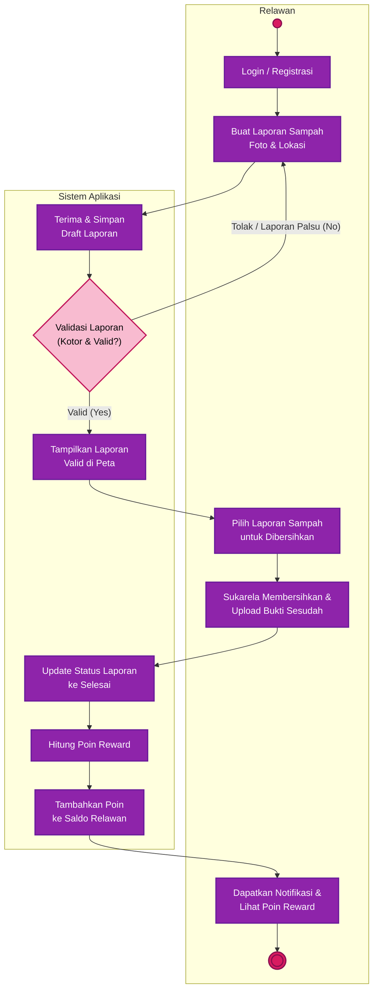

<i>Gambar 1. Activity Diagram Proses Bisnis</i>

SoClean adalah perangkat lunak berbasis *crowdsourcing* yang menyediakan sarana bagi publik untuk berkontribusi dalam upaya pelestarian lingkungan laut melalui pembersihan laut dari sampah-sampah domestik. Dalam implementasinya, perangkat lunak ini menggunakan metode gamifikasi yang kolaboratif sebagai bentuk dorongan komunal dalam usaha memajukan progres SDG ke-14.

Fitur utama yang dapat dimanfaatkan pengguna adalah laporan hasil pembersihan sampah (CleanIt) serta laporan daerah yang terkontaminasi sampah (ReportIt). CleanIt merupakan fitur yang memungkinkan pengguna untuk melaporkan kontribusi langsungnya dalam membersihkan laut. Kontribusi tersebut dapat dikonfirmasi dengan mengunggah bukti, seperti foto atau video yang kemudian ditinjau oleh operator. Setelah hasil CleanIt-nya dinyatakan valid oleh operator, pengguna memperoleh poin untuk akunnya. ReportIt merupakan sarana bagi pengguna untuk melaporkan daerah lautan yang terkontaminasi sampah tanpa harus membersihkan secara langsung daerah tersebut. Pelaporan tersebut bersifat seperti *bounty* yang dapat diambil oleh pengguna lainnya untuk mendapatkan poin. Poin yang diberikan dapat ditukarkan oleh pengguna menjadi *reward* yang dapat mereka pilih.

Perangkat lunak SoClean tersedia sebagai web app yang dapat digunakan oleh pengguna desktop maupun mobile.

## 2.2 Deskripsi Umum Perangkat Lunak

SoClean merupakan perangkat lunak berbasis web yang digunakan untuk mendukung proses bisnis yaitu pelaporan dan penanganan pencemaran sampah domestik pada ekosistem perairan. Perangkat lunak ini dapat diakses melalui browser pada perangkat desktop maupun mobile tanpa memerlukan instalasi tambahan. SoClean menerima input dari Masyarakat dan Operator melalui antarmuka aplikasi serta menyediakan fungsionalitas untuk membuat dan memverifikasi laporan pencemaran, mengirim dan memverifikasi bukti pembersihan, mengelola poin, serta melakukan penukaran poin dengan reward.

SoClean menyediakan fitur ReportIt yang memungkinkan Masyarakat membuat laporan pencemaran dengan memasukkan informasi lokasi, waktu, sumber, dan bukti berupa foto atau video. Dalam pengambilan bukti, SoClean berinteraksi dengan kamera pada perangkat pengguna untuk memperoleh media yang dilengkapi timestamp dan watermark sebagai lampiran laporan. Perangkat lunak memeriksa kelengkapan laporan sebelum dikirim, lalu menyimpan laporan beserta media untuk ditampilkan kepada Operator dalam proses verifikasi. Apabila koneksi internet terputus saat pengisian, input disimpan sementara pada perangkat pengguna, sedangkan pengiriman laporan tetap membutuhkan koneksi internet.

SoClean juga menyediakan fitur CleanIt yang memungkinkan Masyarakat melihat daftar lokasi pencemaran yang telah diverifikasi pada peta [nama layanan peta], melihat informasi lokasi, memilih lokasi untuk dibersihkan, serta mengirimkan bukti pembersihan. Laporan ReportIt yang dinyatakan tidak valid tidak ditampilkan dalam daftar lokasi. Bukti pembersihan ditampilkan kepada Operator untuk diverifikasi. Apabila dinyatakan valid, perangkat lunak memperbarui status laporan dan menambahkan poin ke saldo pengguna. Apabila ditolak, perangkat lunak mengirimkan notifikasi beserta alasan penolakan kepada pengguna.

Selain itu, SoClean menyediakan fitur untuk melihat saldo poin, melihat reward yang tersedia, dan menukarkan poin dengan reward. Dalam proses penukaran, perangkat lunak memeriksa kecukupan poin pengguna dan ketersediaan reward, kemudian mengurangi saldo poin dan persediaan reward serta mencatat transaksi penukaran. Selain kamera dan layanan peta, SoClean tidak terhubung dengan sistem eksternal lain; karena reward berupa dummy, tidak terdapat integrasi dengan payment gateway maupun penyedia reward.

## 2.3 Pengguna dan Kebutuhan Pengguna Perangkat Lunak
<!-- Tuliskan seluruh jenis pengguna (*role*/aktor) yang terlibat dalam perangkat lunak (P/L), beserta kebutuhannya secara umum. Bagian ini dapat disalin dari 1.2 *Deskripsi Pengguna Perangkat Lunak* (dokumen Requirement Gathering) atau 3.1 *Identifikasi Aktor* (dokumen Use Case), pastikan sudah konsisten dengan aktor final yang dipakai di BAB 4.

| Pengguna | Kebutuhan |
| :--- | :--- |
| *Pelanggan* | *Pelanggan harus dapat memesan produk, mengelola keranjang, dan menyelesaikan pembayaran melalui sistem.* |
| *...* | *...* | -->

| Aktor   | Deskripsi                                                                                                                                                                                                                         |
| :------ | :-------------------------------------------------------------------------------------------------------------------------------------------------------------------------------------------------------------------------------- |
| Operator | _Pengguna ini bertindak sebagai pihak yang bertanggung jawab untuk memvalidasi laporan dari ReportIt dan CleanIt. Karakteristik dari pengguna ini adalah mengutamakan kecepatan untuk memverifikasi laporan dalam jumlah yang banyak._ |
| Masyarakat | _Pengguna ini bertindak sebagai pihak yang melaporkan pencemaran (Pelapor) maupun beraksi membersihkan sampah (Relawan) di ekosistem laut dan sungai. Karakteristik dari pengguna ini adalah mengutamakan kemudahan pelaporan dan melihat lokasi._ |

## 2.4 Batasan Perangkat Lunak
Batasan dalam pengembangan perangkat lunak meliputi:
- Software hanya berfokus pada sampah-sampah domestik, sehingga operator hanya menerima laporan ReportIt atau CleanIt dengan bukti sampah domestik.
- Software juga hanya berfokus pada sampah atau limbah yang tidak memerlukan penanganan khusus. Karena berdasarkan UU Nomor 32 Tahun 2009 Pasal 59, pengelolaan limbah B3 butuh dikelola dengan baik dan benar sesuai ketentuan yang berlaku. Operator hanya menerima laporan dengan bukti sampah non-B3.
- Verifikasi laporan dilakukan oleh manusia (operator) sehingga penambahan daerah tercemar (melalui ReportIt) maupun pemberian poin (melalui CleanIt) hanya dapat dilakukan setelah operator menilai sebuah laporan valid.
- Software hanya menyediakan daerah operasional tertentu sehingga laporan hanya dapat dibuat pada wilayah yang terdaftar.
- Berjalan sebagai web app dan berfungsi pada desktop maupun platform mobile.
- Reward yang dapat ditukarkan berupa dummy reward
- Perangkat lunak dapat digunakan dalam mode offline (mengupload media di lokal), namun untuk pengiriman bukti tetap membutuhkan koneksi internet.

## 2.5 Lingkungan Operasi Perangkat Lunak
<!-- Spesifikasi *operating system* atau lingkungan yang dibutuhkan P/L untuk beroperasi. Bagian ini digunakan untuk memastikan pengguna memiliki spesifikasi yang cukup untuk menjalankan P/L. Misalnya mencakup komponen server, client, OS, DBMS, tetapi tidak menutupi kemungkinan komponen lain. -->

| Komponen | Spesifikasi |
| :--- | :--- |
| *Server* | *Next.js 16, dijalankan di docker (bisa local maupun cloud)* |
| *Client* | *Web Browser modern (Chrome, Firefox) pada desktop maupun mobile* |
| *DBMS* | *PostgreSQL 18* |
| *Object Storage* | *S3 based seperti Cloudflare R2* |
| *OS* | *Cross-platform dapat dijalankan di Windows, Linux, dan Android (melalui browser)* |
| *Hardware* | *Perangkat pengguna yang dilengkapi dengan kamera dan GPS untuk melakukan pelaporan* |

---

# BAB 3: Deskripsi Kebutuhan Perangkat Lunak

## 3.1 Kebutuhan Fungsional (KF)

Tabel 2.1. Daftar Kebutuhan Fungsional

| ID KF | ID Kebutuhan | Penjelasan |
| :--- | :--- | :--- |
| *KF01* | *R01* | *Perangkat lunak dapat menampilkan antarmuka pembuatan laporan ketika pengguna memilih fitur ReportIt* |
| *KF02* | *R01* | *Perangkat lunak memiliki fitur untuk terhubung dengan kamera device dan mengambil foto yang disertai watermark dan timestamp ketika pengguna ingin mengambil bukti* |
| *KF03* | *R02* | *Perangkat lunak dapat mengecek kelengkapan laporan sebelum pengguna dapat mengirimkannya* |
| *KF04* | *R03* | *Perangkat lunak dapat menyimpan informasi laporan dan foto/video bukti yang dilampirkan pada laporan ketika dikirimkan oleh pengguna* |
| *KF05* | *R04* | *Perangkat lunak dapat menampilkan antarmuka daftar laporan ketika operator ingin memverifikasi laporan* |
| *KF06* | *R06* | *Perangkat lunak dapat menampilkan daftar laporan yang telah diverifikasi ketika memilih fitur CleanIt* |
| *KF07* | *R06* | *Perangkat lunak dapat menampilkan antarmuka yang berisi informasi lengkap mengenai laporan (lokasi, waktu, sumber, bukti) ketika pengguna memilih laporan pada fitur CleanIt* |
| *KF08* | *R08* | *Perangkat lunak dapat menampilkan antarmuka pembuatan laporan bukti pembersihan ketika pengguna ingin melaporkan penyelesaian pembersihan* |
| *KF09* | *R11* | *Perangkat lunak dapat menampilkan antarmuka daftar penyelesaian katika operator ingin memverifkasinya* |
| *KF10* | *R13* | *Perangkat lunak memberikan poin yang dapat ditukarkan dengan reward kepada pengguna setelah laporan pembersihan diverifikasi* |
| *KF11* | *R13* | *Perangkat lunak dapat menyesuaikan jumlah poin pengguna serta jumlah persediaan reward yang tersedia ketika terjadi penambahan atau pengurangan* |
| *KF12* | *R15* | *Perangkat lunak dapat menampilkan antarmuka penukaran reward yang menampilkan jumlah poin pengguna dan reward yang tersedia untuk ditukarkan ketika pengguna memilih fitur penukaran* |
| *KF13* | *R15* | *Perangkat lunak dapat menukarkan koin dengan reward yang tersedia ketika pengguna mengonfirmasi penukaran* |

<!-- Salin ulang **seluruh Kebutuhan Fungsional (KF)** versi terbaru dari BAB 2.1 dokumen *Class Diagram* (sudah versi final dan sudah memakai format EARS). Pastikan ID Kebutuhan (kolom "ID Kebutuhan") juga konsisten dengan ID pada tabel Pemetaan Kebutuhan di dokumen *Requirement Gathering*.

Tabel 3.1. Kebutuhan Fungsional

| ID KF | ID Kebutuhan | Penjelasan |
| :--- | :--- | :--- |
| *KF01* | *R01* | *Ketika pelanggan membuka halaman katalog, sistem harus menampilkan daftar produk yang tersedia.* |
| *KF02* | *R02* | *Ketika pelanggan memilih "Tambah ke Keranjang" pada suatu produk, sistem harus menyimpan produk tersebut ke dalam keranjang pelanggan.* |
| *KF03* | *R03* | *Ketika pelanggan menekan tombol checkout, sistem harus menampilkan pilihan metode pembayaran yang tersedia.* |
| *KF04* | *R04* | *Ketika pelanggan memilih metode pembayaran, sistem harus mengirimkan permintaan otorisasi beserta nominal tagihan dan ID pesanan ke payment gateway (dummy).* |
| *KF05* | *R04* | *Ketika payment gateway (dummy) mengembalikan status pembayaran berhasil, sistem harus memperbarui status pesanan menjadi "Lunas" dan menampilkan notifikasi pembayaran berhasil.* |
| *KF06* | *R05* | *Ketika pelanggan membuka menu riwayat pesanan, sistem harus menampilkan daftar pesanan beserta statusnya.* |
| *KFXX* | *...* | *...* |

-->

## 3.2 Kebutuhan Non-Fungsional (KNF)
| ID KNF | ID Kebutuhan | Parameter | Deskripsi Kebutuhan |
| :--- | :--- | :--- | :--- |
| KNF01 | R04 | *Response time* | *Ketika operator membuka interface daftar laporan yang menunggu verifikasi, sistem harus menampilkan seluruh laporan dalam waktu maksimal 2 detik meskipun jumlah laporan tertunda mencapai ratusan.* |
| KNF02 | R06 | *Response time* | *Ketika pengguna membuka peta lokasi pencemaran pada fitur CleanIt, sistem harus menampilkan seluruh titik laporan di sekitar lokasi pengguna dalam waktu maksimal 3 detik.* |
| KNF03 | R01 | *Portability* | *Sistem harus dapat diakses dan berfungsi dengan baik melalui browser pada perangkat desktop maupun mobile tanpa memerlukan install tambahan.* |
| KNF04 | R08 | *Reliability* | *Bila proses unggah foto/video bukti laporan gagal, maka sistem harus menampilkan notifikasi kegagalan kepada pengguna dan mencegah laporan berubah status menjadi "terkirim".* |
| KNF05 | R16 | *Reliability* | *Bila terjadi kegagalan jaringan atau sistem selama proses penukaran poin berlangsung, maka sistem harus membatalkan seluruh transaksi (rollback) sehingga saldo poin pengguna tidak berkurang tanpa reward yang tercatat.* |
| KNF06 | R01 | *Availability* | *Sistem harus tersedia (uptime) minimal 99% setiap bulan agar masyarakat dapat mengirimkan laporan ReportIt kapan saja.* |
| KNF07 | R01 | *Reliability* | *Selama perangkat pengguna terputus dari koneksi internet saat mengisi form ReportIt, sistem harus menyimpan sementara input pengguna secara lokal (cache).* |

<!-- Salin ulang Kebutuhan Non-Fungsional dari BAB 2.5 dokumen *Requirement Gathering*, sesuaikan ID Kebutuhan (kolom "ID Kebutuhan") apabila terjadi perubahan penomoran pada BAB 3.1 di atas.

Tabel 3.2. Kebutuhan Non-Fungsional

| ID KNF | ID Kebutuhan | Parameter | Deskripsi Kebutuhan |
| :--- | :--- | :--- | :--- |
| *KNF01* | *R03* | *Reliability* | *Proses transaksi pembayaran harus memenuhi prinsip ACID untuk mencegah terjadinya data tersangkut (lost update) apabila terjadi kegagalan jaringan di tengah proses.* |
| *KNF02* | *R04* | *Security* | *Sistem harus mengenkripsi PIN atau password pengguna menggunakan algoritma SHA-256 sebelum data dikirimkan ke server, serta tidak menyimpannya dalam bentuk plain-text di database.* |
| *...* | *...* | *...* | *...* |

*Silakan pilih parameter yang relevan dengan P/L kalian (Availability, Reliability, Ergonomy, Portability, Memory, Response time, Safety, Security, dsb), tidak perlu semua parameter diisi. Lihat kembali dokumen Requirement Gathering untuk penjelasan tiap parameter.*

-->

---

# BAB 4: Pemodelan Use Case

## 4.1 Identifikasi Aktor

| ID Aktor | Aktor   | Deskripsi                                                                                                                                                                                                                         |
| :----- | :------ | :-------------------------------------------------------------------------------------------------------------------------------------------------------------------------------------------------------------------------------- |
| A01 | Operator | _Pengguna ini bertindak sebagai pihak yang bertanggung jawab untuk memvalidasi laporan dari ReportIt dan CleanIt. Karakteristik dari pengguna ini adalah mengutamakan kecepatan untuk memverifikasi laporan dalam jumlah yang banyak._ |
| A02 | Masyarakat | _Pengguna ini bertindak sebagai pihak yang melaporkan pencemaran (Pelapor) maupun beraksi membersihkan sampah (Relawan) di ekosistem laut dan sungai. Karakteristik dari pengguna ini adalah mengutamakan kemudahan pelaporan dan melihat lokasi._ |

<!--
Salin ulang daftar aktor final dari BAB 3.1 dokumen *Use Case & Scenario Use Case* atau *Class Diagram*. Tambahkan ID Aktor mengikuti Aturan Penomoran pada 1.4.

| ID Aktor | Aktor | Deskripsi |
| :--- | :--- | :--- |
| *A01* | *Pelanggan* | *Pengguna yang memesan produk, mengelola keranjang, dan menyelesaikan pembayaran melalui sistem.* |
| *...* | *...* | *...* |
-->

## 4.2 Identifikasi Use Case

| ID UC | Nama Use Case | Deskripsi Singkat | Aktor Terlibat | ID KF Terkait |
| :--- | :--- | :--- | :--- | :--- |
| *UC01* | *Membuat Laporan Pencemaran (konsep ReportIt)* | *Masyarakat melaporkan lokasi perairan yang terkontaminasi sampah beserta bukti foto/video untuk diajukan ke Operator.* | *Masyarakat* | *KF01, KF03, KF04* |
| *UC02* | *Mengambil Bukti Foto/Video* | *Sistem menggunakan kamera device pengguna untuk mengambil foto/video bukti yang otomatis diberi watermark dan timestamp, digunakan sebagai lampiran pada laporan ReportIt maupun CleanIt.* | *Masyarakat* | *KF02* |
| *UC03* | *Memverifikasi Laporan ReportIt* | *Operator meninjau laporan pencemaran yang masuk beserta buktinya dan menentukan validitasnya agar laporan valid dapat ditampilkan sebagai bounty di peta.* | *Operator* | *KF05* |
| *UC04* | *Melihat Daftar Lokasi Pencemaran (CleanIt)* | *Masyarakat periksa daftar lokasi tercemar yang telah terverifikasi beserta detail informasinya (lokasi, waktu, sumber, bukti) sebelum memilih lokasi untuk dibersihkan.* | *Masyarakat* | *KF06, KF07* |
| *UC05* | *Mengirimkan Bukti Pembersihan (CleanIt)* | *Masyarakat yang telah membersihkan lokasi tercemar mengirimkan laporan penyelesaian beserta bukti foto/video pembersihan untuk diverifikasi Operator.* | *Masyarakat* | *KF08* |
| *UC06* | *Memverifikasi Laporan Pembersihan (CleanIt)* | *Operator meninjau laporan penyelesaian CleanIt yang masuk dan menentukan validitasnya. Apabila laporan valid, sistem memberikan poin reward ke akun Masyarakat terkait.* | *Operator* | *KF09, KF10, KF11* |
| *UC07* | *Melihat Saldo Poin* | *Masyarakat melihat saldo poin* | *Masyarakat* | *KF11, KF12* |
| *UC08* | *Melihat Reward yang Tersedia* | *Masyarakat melihat daftar reward yang tersedia* | *Masyarakat* | *KF11, KF12* |
| *UC09* | *Menukarkan Poin dengan Reward* | *Masyarakat menukarkan poin yang dimiliki dengan reward yang dipilihnya* | *Masyarakat* | *KF11, KF12*, *KF13* |

<!-- Salin ulang daftar Use Case versi terbaru dari BAB 3.2 dokumen *Class Diagram*, pastikan seluruh ID KF yang dirujuk sudah sesuai dengan tabel pada 3.1.

| ID UC | Nama Use Case | Deskripsi Singkat | Aktor | ID KF |
| :--- | :--- | :--- | :--- | :--- |
| *UC01* | *Memesan Produk* | *Pelanggan memilih produk hingga pesanan tersimpan di sistem.* | *Pelanggan* | *KF01, KF02* |
| *UC02* | *Melihat Keranjang* | *Pelanggan melihat daftar item yang telah dipilih sebelum checkout.* | *Pelanggan* | *KF02* |
| *UC03* | *Melakukan Pembayaran* | *Pelanggan menyelesaikan pembayaran atas pesanan yang dibuat.* | *Pelanggan* | *KF03, KF04, KF05* |
| *UC04* | *Memilih Metode Pembayaran* | *Pelanggan memilih metode pembayaran alternatif (kartu atau e-wallet).* | *Pelanggan* | *KF03* |
| *UC05* | *Melihat Riwayat Pesanan* | *Pelanggan melihat daftar pesanan yang pernah dibuat beserta statusnya.* | *Pelanggan* | *KF06* |
| *...* | *...* | *...* | *...* | *...* |

-->

## 4.3 Use Case Diagram
<!-- Salin ulang Use Case Diagram dari BAB 3.3 dokumen *Use Case & Scenario Use Case* atau *Class Diagram* (gunakan versi paling akhir/terbaru apabila terdapat perubahan). -->

 

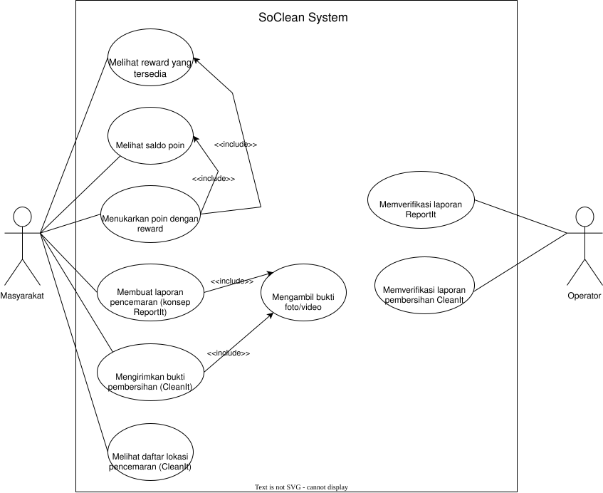

<i>Gambar 1. Use Case Diagram</i>

 

## 4.4 Skenario Use Case

## 3.4 Skenario Use Case

### 3.4.1 Skenario UC01

**Nama Use Case:** *Membuat Laporan Pencemaran*

**Skenario Normal**

| No | Aksi Aktor | Reaksi Perangkat Lunak |
| :--- | :--- | :--- |
| 1 | *Pengguna memilih menu ReportIt* | *Sistem menampilkan form pembuatan laporan* |
| 2 | *Pengguna mengisi informasi pada laporan* | *Sistem mengonfirmasi kecocokan informasi dengan format* |
| 4 | *Pengguna mengirimkan laporan* | *Sistem mengecek kelengkapan laporan, menampilkan notifikasi laporan dikirimkan, dan menampilkan instruksi untuk menunggu konfirmasi* |

 

**Skenario Alternatif 1: Informasi Tidak Sesuai Format**

| No | Aksi Aktor | Reaksi Perangkat Lunak |
| :--- | :--- | :--- |
| 1 | *Pengguna memilih menu ReportIt* | *Sistem menampilkan form pembuatan laporan* |
| 2 | *Pengguna mengisi informasi pada laporan* | *Sistem mengirimkan notifikasi bahwa informasi tidak sesuai dan menampilkan contoh format yang sesuai* |
| 3 | *Pengguna memperbaiki informasi pada laporan* | *Sistem mengonfirmasi kecocokan informasi dengan format* |
| 4 | *Pengguna mengirimkan laporan* | *Sistem mengecek kelengkapan laporan, menampilkan notifikasi laporan dikirimkan, dan menampilkan instruksi untuk menunggu konfirmasi* |

 

**Skenario Alternatif 2: Informasi Pada Laporan Tidak Lengkap**

| No | Aksi Aktor | Reaksi Perangkat Lunak |
| :--- | :--- | :--- |
| 1 | *Pengguna memilih menu ReportIt* | *Sistem menampilkan form pembuatan laporan* |
| 2 | *Pengguna mengisi informasi pada laporan* | *Sistem mengonfirmasi kecocokan informasi dengan format* |
| 3 | *Pengguna mengirimkan laporan* | *Sistem menampilkan notifikasi bahwa masih ada informasi yang belum diisi atau tidak lengkap dan menandakannya menggunakan penanda warna(?)* |
| 4 | *Pengguna melengkapi isi laporan* | *Sistem mengecek kelengkapan laporan, menampilkan notifikasi laporan dikirimkan, dan menampilkan instruksi untuk menunggu konfirmasi* |

### 3.4.2 Skenario UC02

**Nama Use Case:** *Mengambil Bukti Foto/Video*

**Skenario Normal**

| No | Aksi Aktor | Reaksi Perangkat Lunak |
| :--- | :--- | :--- |
| 1 | *Pengguna memilih menu pengambilan gambar* | *Sistem menampilkan antarmuka pengambilan gambar yang terdiri dari fitur kamera dan timestamp pada bagian kanan bawah* |
| 2 | *Pengguna menekan tombol pengambilan gambar* | *Perangkat akan mengambil foto/video yang disertai timestamp dan menyimpan hasilnya pada penyimpanan perangkat* |

 

**Skenario Alternatif 1: Penyimpanan Perangkat Penuh**

| No | Aksi Aktor | Reaksi Perangkat Lunak |
| :--- | :--- | :--- |
| 1 | *Pengguna memilih menu pengambilan gambar* | *Sistem menampilkan antarmuka pengambilan gambar yang terdiri dari fitur kamera dan timestamp pada bagian kanan bawah* |
| 2 | *Pengguna menekan tombol pengambilan gambar* | *Sistem menampilkan notifikasi bahwa penyimpanan perangkat penuh dan foto/video tidak tersimpan* |

### 3.4.3 Skenario UC03

**Nama Use Case:** *Memverifikasi Laporan ReportIt*

**Skenario Normal**

| No | Aksi Aktor | Reaksi Perangkat Lunak |
| :--- | :--- | :--- |
| 1 | *Operator memilih menu verifikasi laporan ReportIt* | *Sistem menampilkan daftar laporan yang belum diverifikasi* |
| 2 | *Operator memilih salah satu laporan ReportIt* | *Sistem menampilkan detail dan informasi laporan seperti bukti foto/video* |
| 3 | *Operator memeriksa validitas laporan* | *Sistem menampilkan pilihan untuk menyatakan valid/tidak* |
| 4 | *Operator menyatakan laporan valid* | *Sistem menyimpan status laporan sebagai valid dan menampilkan lokasi di laporan sebagai lokasi pencemaran yang dapat dipilih pada CleanIt* |

 

**Skenario Alternatif 1: Laporan Tidak Valid**

| No | Aksi Aktor | Reaksi Perangkat Lunak |
| :--- | :--- | :--- |
| 1 | *Operator memilih menu verifikasi laporan ReportIt* | *Sistem menampilkan daftar laporan yang belum diverifikasi* |
| 2 | *Operator memilih salah satu laporan ReportIt* | *Sistem menampilkan detail dan informasi laporan seperti bukti foto/video* |
| 3 | *Operator memeriksa validitas laporan* | *Sistem menampilkan pilihan untuk menyatakan valid/tidak* |
| 4 | *Operator menyatakan laporan tidak valid* | *Sistem menyimpan status laporan sebagai tidak valid dan tidak menampilkan lokasi di daftar lokasi untuk dibersihkan* |

### 3.4.4 Skenario UC04

**Nama Use Case:** *Melihat Daftar Lokasi Pencemaran (CleanIt)*

**Skenario Normal**

| No | Aksi Aktor | Reaksi Perangkat Lunak |
| :--- | :--- | :--- |
| 1 | *Pengguna memilih fitur CleanIt* | *Sistem menampilkan daftar lokasi pencemaran yang telah diverifikasi* |
| 2 | *Pengguna memilih salah satu lokasi* | *Sistem menampilkan informasi lengkap terkait lokasi tersebut* |
| 3 | *Pengguna memilih lokasi untuk dibersihkan* | *Sistem menampilkan konfirmasi bahwa lokasi tersebut dipilih untuk dibersihkan* |

 

**Skenario Alternatif 1: Tidak Ada Lokasi Pencemaran di Daftar**

| No | Aksi Aktor | Reaksi Perangkat Lunak |
| :--- | :--- | :--- |
| 1 | *Pengguna memilih fitur CleanIt* | *Sistem tidak menemukan lokasi pencemaran yang telah diverifikasi* |
| 2 | - |  *Sistem menampilkan notifikasi bahwa belum terdapat lokasi pencemaran yang tersedia untuk dibersihkan* |

### 3.4.5 Skenario UC05

**Nama Use Case:** *Mengirimkan Bukti Pembersihan (CleanIt)*

**Skenario Normal**

| No | Aksi Aktor | Reaksi Perangkat Lunak |
| :--- | :--- | :--- |
| 1 | *Pengguna memilih menu CleanIt* | *Sistem menampilkan antarmuka untuk mengirimkan bukti pembersihan* |
| 2 | *Pengguna mengisi informasi bukti pembersihan* | *Sistem mengonfirmasi kecocokan informasi dengan format yang benar* |
| 3 | *Pengguna mengirimkan bukti pembersihan* | *Sistem menyimpan bukti pembersihan dan memberikan konfirmasi kepada pengguna* |

 

**Skenario Alternatif 1: Pengiriman Bukti Pembersihan Gagal (misal: file terlalu besar)**

| No | Aksi Aktor | Reaksi Perangkat Lunak |
| :--- | :--- | :--- |
| 1 | *Pengguna memilih menu CleanIt* | *Sistem menampilkan antarmuka untuk mengirimkan bukti pembersihan* |
| 2 | *Pengguna mengisi informasi bukti pembersihan* | *Sistem mengonfirmasi kecocokan informasi dengan format yang benar* |
| 3 | *Pengguna mengirimkan bukti pembersihan* | *Sistem menampilkan notifikasi bahwa pengiriman bukti pembersihan gagal* |

### 3.4.6 Skenario UC06

**Nama Use Case:** *Memverifikasi Laporan Pembersihan (CleanIt)*

**Skenario Normal**

| No | Aksi Aktor | Reaksi Perangkat Lunak |
| :--- | :--- | :--- |
| 1 | *Operator membuka menu untuk melihat laporan masuk* | *Sistem menampilkan daftar laporan pembersihan yang masuk* |
| 2 | *Operator memilih laporan untuk diperiksa* | *Sistem menampilkan detail laporan pembersihan* |
| 3 | *Operator menyetujui laporan* | *Sistem menyimpan perubahan dan memberikan poin ke akun pengguna* |

 

**Skenario Alternatif 1: Operator menolak laporan karena bukti tidak sah**

| No | Aksi Aktor | Reaksi Perangkat Lunak |
| :--- | :--- | :--- |
| 1 | *Operator membuka menu untuk melihat laporan masuk* | *Sistem menampilkan daftar laporan pembersihan yang masuk* |
| 2 | *Operator memilih laporan untuk diperiksa* | *Sistem menampilkan detail laporan pembersihan* |
| 3 | *Operator menolak laporan karena bukti tidak sah dan mengisi alasan* | *Sistem menyimpan perubahan dan dan mengirimkan notifikasi alasan penolakan kepada pengguna* |

### 3.4.7 Skenario UC07

**Nama Use Case:** *Melihat Saldo Poin*

**Skenario Normal**

| No | Aksi Aktor | Reaksi Perangkat Lunak |
| :--- | :--- | :--- |
| 1 | *Pengguna membuka menu untuk melihat saldo poin* | *Sistem menampilkan saldo poin pengguna* |

### 3.4.8 Skenario UC08

**Nama Use Case:** *Melihat Reward yang Tersedia*

**Skenario Normal**

| No | Aksi Aktor | Reaksi Perangkat Lunak |
| :--- | :--- | :--- |
| 1 | *Pengguna membuka menu untuk melihat reward yang tersedia* | *Sistem menampilkan daftar reward yang tersedia* |

### 3.4.9 Skenario UC09

**Nama Use Case:** *Menukarkan Poin dengan Reward*

**Skenario Normal**

| No | Aksi Aktor | Reaksi Perangkat Lunak |
| :--- | :--- | :--- |
| 1 | *Pengguna memilih hadiah untuk diklaim* | *Sistem melakukan pengecekan terhadap jumlah poin pengguna dan harga poin hadiah* |
| 2 | *-* | *Apabila jumlah poin pengguna dan harga poin hadiah sesuai, poin pengguna dipotong dan hadiah diklaim oleh pengguna* |

 

**Skenario Alternatif 1: Poin tidak cukup**

| No | Aksi Aktor | Reaksi Perangkat Lunak |
| :--- | :--- | :--- |
| 1 | *Pengguna memilih hadiah untuk diklaim* | *Sistem melakukan pengecekan terhadap jumlah poin pengguna dan harga poin hadiah* |
| 2 | *-* | *Sistem mengirimkan notifikasi gagal mengklaim produk akibat jumlah poin yang kurang* |

<!-- Salin ulang skenario **setiap** use case (skenario normal dan alternatif) dari BAB 3.4 dokumen *Use Case & Scenario Use Case*, sesuaikan dengan daftar UC final pada 4.2. Jika use case melibatkan lebih dari satu aktor manusia yang benar-benar berinteraksi langsung (misalnya *Kasir* yang memverifikasi transaksi setelah *Pelanggan* membayar), tambahkan kolom aksi tersendiri untuk aktor tersebut di samping kolom "Reaksi Perangkat Lunak". Sistem eksternal otomatis seperti *payment gateway* **bukan aktor**, sehingga interaksinya cukup dituliskan sebagai bagian dari "Reaksi Perangkat Lunak", bukan kolom aktor terpisah.

### 4.4.1 Skenario UC01

**Nama Use Case:** *Memesan Produk*

**Skenario Normal**

| No | Aksi Aktor | Reaksi Perangkat Lunak |
| :--- | :--- | :--- |
| 1 | *Pelanggan memilih produk dari katalog* | *Sistem menampilkan detail produk dan menambahkannya ke keranjang* |
| 2 | *Pelanggan menekan tombol checkout* | *Sistem membuat pesanan baru dari isi keranjang dan menampilkan ringkasan pesanan* |
| ... | *...* | *...* |

**Skenario Alternatif 1: Produk Tidak Tersedia**

| No | Aksi Aktor | Reaksi Perangkat Lunak |
| :--- | :--- | :--- |
| 1 | *Pelanggan memilih produk dari katalog* | *Sistem menampilkan pesan "Produk tidak tersedia" karena stok habis* |
| 2 | *Pelanggan memilih produk lain* | *Sistem kembali ke langkah 1 skenario normal* |
| ... | *...* | *...* |

*Lanjutkan pola 4.4.x ini untuk setiap ID UC pada 4.2, sampai seluruh use case memiliki skenarionya masing-masing.*

-->

---

# BAB 5: Pemodelan Kelas

## 5.1 Identifikasi Kelas

| ID Kelas | Nama Kelas | Deskripsi Kelas | ID Use Case |
| :--- | :--- | :--- | :--- |
| C01 | *FormLaporan* | *Menyediakan tampilan serta fungsionalitas formulir input untuk laporan (baik CleanIt maupun ReportIt) bagi pengguna masyarakat* | *UC01, UC02, UC05* |
| C02 | *Laporan* | *Menyimpan informasi yang berada di laporan yang telah dikirim oleh pengguna masyarakat, yaitu bukti, lokasi, waktu, keterangan* | *UC01, UC03, UC05, UC06* |
| C03 | *Media* | *Menyediakan kemampuan pengambilan bukti (foto/video) yang akan dicantumkan dalam laporan* | *UC02* |
| C04 | *DaftarLaporan* | *Menyimpan dan menampilkan daftar submisi laporan* | *UC01, UC03, UC05, UC06* |
| C05 | *ValidatorLaporan* | *Menyediakan kemampuan bagi operator untuk mengubah status validitas sebuah laporan dan memetakan lokasi pencemaran* | *UC03, UC06* |
| C06 | *Lokasi* | *Menyimpan informasi posisi pencemaran pada daftar lokasi* | *UC03, UC04* |
| C07 | *DaftarLokasi* | *Menyimpan dan menampilkan daftar lokasi pencemaran* | *UC04* |
| C08 | *Pengguna* | *Menyimpan informasi terkait poin yang dimiliki* | *UC07, UC09* |
| C09 | *Reward* | *Menyimpan informasi terkait jenis, jumlah, dan harga reward itu sendiri* | *UC08, UC09* |
| C10 | *DaftarReward* | *Menyimpan dan menampilkan daftar reward yang tersedia* | *UC08, UC09* |
| C11 | *ManagerPoin* | *Mengatur perhitungan poin dalam transaksi reward* | *UC07, UC08, UC09* |
| C12 | *HalamanPenukaran* | *Menyediakan tampilan bagi pengguna masyarakat untuk melihat saldo poin dan daftar reward yang tersedia, memilih reward yang ingin ditukarkan, serta menampilkan notifikasi hasil penukaran* | *UC07, UC08, UC09* |
| C13 | *Penukaran* | *Menyimpan catatan satu transaksi penukaran poin dengan reward, yaitu pengguna yang menukarkan, reward yang ditukarkan, jumlah poin yang dipakai, dan waktu penukaran, sebagai bukti klaim reward* | *UC09* |

<!-- Salin ulang seluruh kelas yang telah diidentifikasi dari BAB 4.1 dokumen *Class Diagram*.

| ID Kelas | Nama Kelas | Deskripsi Kelas | ID Use Case |
| :--- | :--- | :--- | :--- |
| *C01* | *Pelanggan* | *Menyimpan data akun pelanggan yang membuat pesanan.* | *UC01, UC05* |
| *C02* | *Pesanan* | *Menyimpan data pesanan beserta status pembayarannya.* | *UC01, UC03, UC05* |
| *C03* | *Keranjang* | *Menyimpan sementara item yang dipilih sebelum checkout.* | *UC01, UC02* |
| *...* | *...* | *...* | *...* | -->

## 5.2 Diagram Kelas per Use Case

### 5.2.1 Use Case UC01

**Nama Use Case:** *Membuat Laporan Pencemaran*

#### Identifikasi Kelas

| ID Kelas | Nama Kelas | Deskripsi Kelas |
| :--- | :--- | :--- |
| *C01* | *FormLaporan* | *Menyediakan tampilan serta fungsionalitas formulir input untuk laporan (baik CleanIt maupun ReportIt) bagi pengguna masyarakat.* |
| *C02* | *Laporan* | *Menyimpan informasi yang berada di laporan yang telah dikirim oleh pengguna masyarakat, yaitu bukti, lokasi, waktu, keterangan.* |
| *C04* | *DaftarLaporan* | *Menyimpan dan menampilkan daftar submisi laporan* |

#### Diagram Kelas

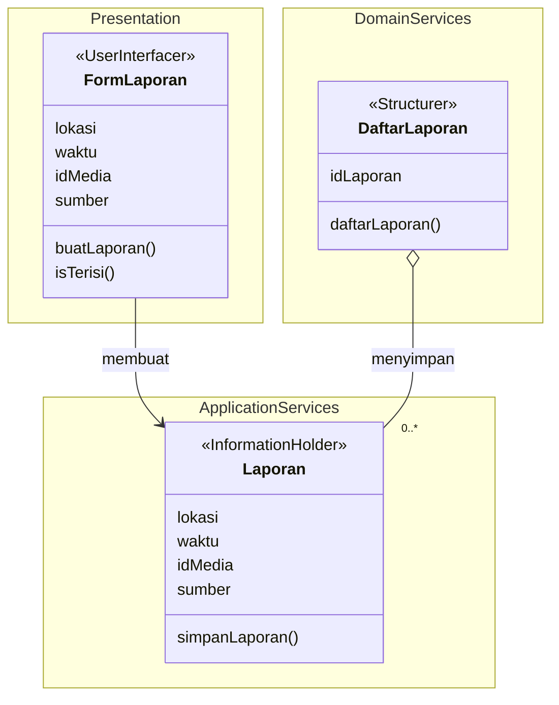

<i>Gambar 2. Diagram Kelas Use Case UC01</i>

 

| ID Kelas | Nama Kelas | Atribut | Metode/Operasi |
| :--- | :--- | :--- | :--- |
| *C01* | *FormLaporan* | *lokasi, waktu, idMedia, sumber* | *buatLaporan(), isTerisi()* |
| *C02* | *Laporan* | *lokasi, waktu, idMedia, sumber* | *simpanLaporan()* |
| *C04* | *DaftarLaporan* | *idLaporan* | *daftarLaporan()* |

### 5.2.2 Use Case UC02

**Nama Use Case:** *Mengambil Bukti Foto/Video*

#### Identifikasi Kelas

| ID Kelas | Nama Kelas | Deskripsi Kelas |
| :--- | :--- | :--- |
| *C01* | *FormLaporan* | *Menyediakan tampilan serta fungsionalitas formulir input untuk laporan (baik CleanIt maupun ReportIt) bagi pengguna masyarakat.* |
| *C03* | *Media* | *Menyediakan kemampuan pengambilan bukti (foto/video) yang akan dicantumkan dalam laporan* |

#### Diagram Kelas

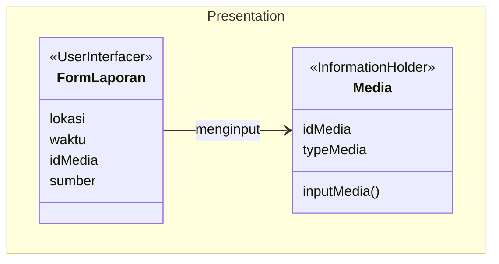

<i>Gambar 3. Diagram Kelas Use Case UC02</i>

 

| ID Kelas | Nama Kelas | Atribut | Metode/Operasi |
| :--- | :--- | :--- | :--- |
| *C01* | *FormLaporan* | *lokasi, waktu, idMedia, sumber* | *-* |
| *C03* | *Media* | *idMedia, typeMedia* | *inputMedia()* |

### 5.2.3 Use Case UC03

**Nama Use Case:** *Memverifikasi Laporan ReportIt*

#### Identifikasi Kelas

| ID Kelas | Nama Kelas | Deskripsi Kelas |
| :--- | :--- | :--- |
| *C02* | *Laporan* | *Menyimpan informasi yang berada di laporan yang telah dikirim oleh pengguna masyarakat, yaitu bukti, lokasi, waktu, keterangan.* |
| *C04* | *DaftarLaporan* | *Menyimpan dan menampilkan daftar submisi laporan* |
| *C05* | *ValidatorLaporan* | *Menyediakan kemampuan bagi operator untuk mengubah status validitas sebuah laporan dan memetakan lokasi pencemaran* |
| *C06* | *Lokasi* | *Menyimpan informasi posisi pencemaran pada daftar lokasi* | 

#### Diagram Kelas

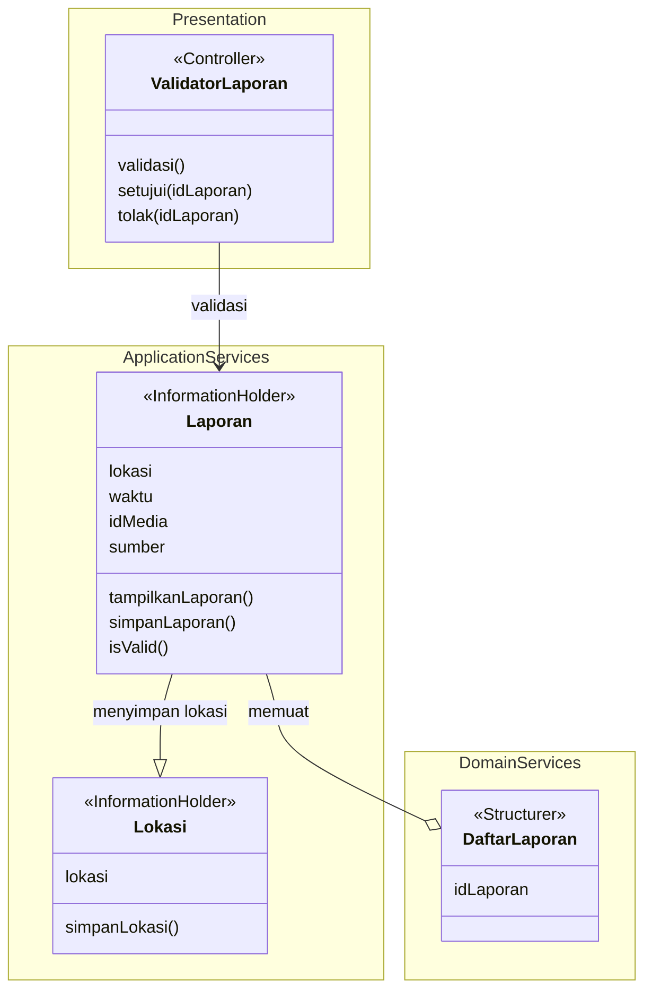

<i>Gambar 4. Diagram Kelas Use Case UC03</i>

 

| ID Kelas | Nama Kelas | Atribut | Metode/Operasi |
| :--- | :--- | :--- | :--- |
| *C02* | *Laporan* | *lokasi, waktu, idMedia, sumber* | *tampilkanLaporan(), simpanLaporan(), isValid()* |
| *C04* | *DaftarLaporan* | *idLaporan* | *-* |
| *C05* | *ValidatorLaporan* | - | *validasi(), setujui(idLaporan), tolak(idLaporan)* |
| *C06* | *Lokasi* | *lokasi* | *simpanLokasi()* |

### 5.2.4 Use Case UC04

**Nama Use Case:** *Melihat Daftar Lokasi Pencemaran (CleanIt)*

#### Identifikasi Kelas

| ID Kelas | Nama Kelas | Deskripsi Kelas |
| :--- | :--- | :--- |
| *C07* | *DaftarLokasi* | *Menyimpan dan menampilkan daftar lokasi pencemaran* |
| *C06* | *Lokasi* | *Menyimpan informasi posisi pencemaran pada daftar lokasi* |

#### Diagram Kelas

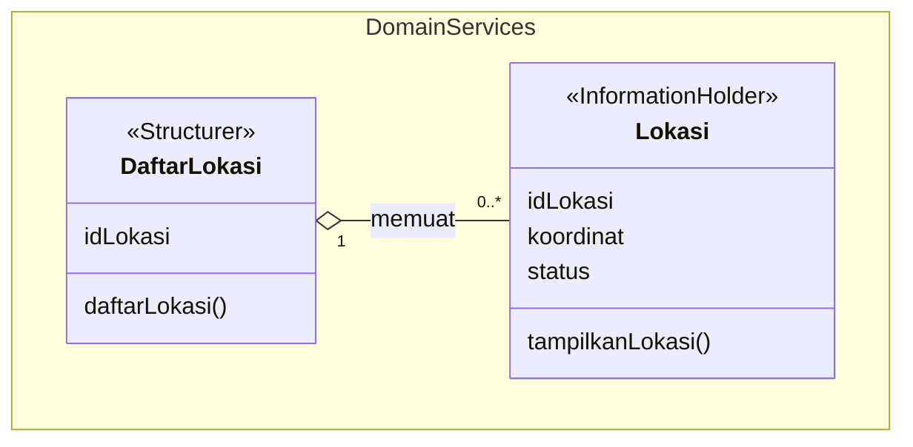

<i>Gambar X. Diagram Kelas Use Case UC04</i>

| ID Kelas | Nama Kelas | Atribut | Metode/Operasi |
| :--- | :--- | :--- | :--- |
| *C07* | *DaftarLokasi* | *idLokasi* | *daftarLokasi()* |
| *C06* | *Lokasi* | *idLokasi, koordinat, status* | *tampilkanLokasi()* |

### 5.2.5 Use Case UC05

**Nama Use Case:** *Mengirimkan Bukti Pembersihan (CleanIt)*

#### Identifikasi Kelas

| ID Kelas | Nama Kelas | Deskripsi Kelas |
| :--- | :--- | :--- |
| *C01* | *FormLaporan* | *Menyediakan tampilan serta fungsionalitas formulir input untuk laporan (baik CleanIt maupun ReportIt) bagi pengguna masyarakat.* |
| *C02* | *Laporan* | *Menyimpan informasi yang berada di laporan yang telah dikirim oleh pengguna masyarakat, yaitu bukti, lokasi, waktu, keterangan.* |
| *C04* | *DaftarLaporan* | *Menyimpan dan menampilkan daftar submisi laporan* |

#### Diagram Kelas

<i>Gambar 2. Diagram Kelas Use Case UC01</i>

 

| ID Kelas | Nama Kelas | Atribut | Metode/Operasi |
| :--- | :--- | :--- | :--- |
| *C01* | *FormLaporan* | *lokasi, waktu, idMedia, sumber* | *buatLaporan(), isTerisi()* |
| *C02* | *Laporan* | *lokasi, waktu, idMedia, sumber* | *simpanLaporan()* |
| *C04* | *DaftarLaporan* | *idLaporan* | *daftarLaporan()* |

### 5.2.6 Use Case UC06

**Nama Use Case:** *Memverifikasi Laporan Pembersihan (CleanIt)*

#### Identifikasi Kelas

| ID Kelas | Nama Kelas | Deskripsi Kelas |
| :--- | :--- | :--- |
| *C02* | *Laporan* | *Menyimpan informasi yang berada di laporan yang telah dikirim oleh pengguna masyarakat, yaitu bukti, lokasi, waktu, keterangan* |
| *C04* | *DaftarLaporan* | *Menyimpan dan menampilkan daftar submisi laporan* |
| *C05* | *ValidatorLaporan* | *Menyediakan kemampuan bagi operator untuk mengubah status validitas sebuah laporan dan memetakan lokasi pencemaran* |
| *C11* | *ManagerPoin* | *Mengatur perhitungan poin dalam transaksi reward* |

#### Diagram Kelas

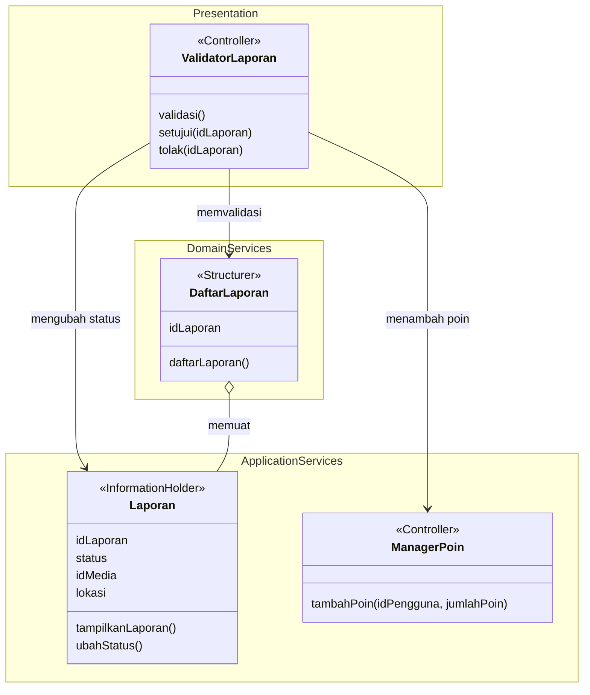

<i>Gambar X. Diagram Kelas Use Case UC06</i>

| ID Kelas | Nama Kelas | Atribut | Metode/Operasi |
| :--- | :--- | :--- | :--- |
| *C02* | *Laporan* | *idLaporan, status, idMedia, lokasi* | *tampilkanLaporan(), ubahStatus()* |
| *C04* | *DaftarLaporan* | *idLaporan* | *daftarLaporan()* |
| *C05* | *ValidatorLaporan* | *-* | *validasi(), setujui(idLaporan), tolak(idLaporan)* |
| *C11* | *ManagerPoin* | *-* | *tambahPoin(idPengguna, jumlahPoin)* |

### 5.2.7 Use Case UC07

**Nama Use Case:** *Melihat Saldo Poin*

#### Identifikasi Kelas

| ID Kelas | Nama Kelas | Deskripsi Kelas |
| :--- | :--- | :--- |
| *C12* | *HalamanReward* | *Menampilkan saldo poin pengguna pada menu poin dan reward.* |
| *C08* | *Pengguna* | *Menyimpan informasi akun pengguna beserta saldo poinnya.* |

#### Diagram Kelas

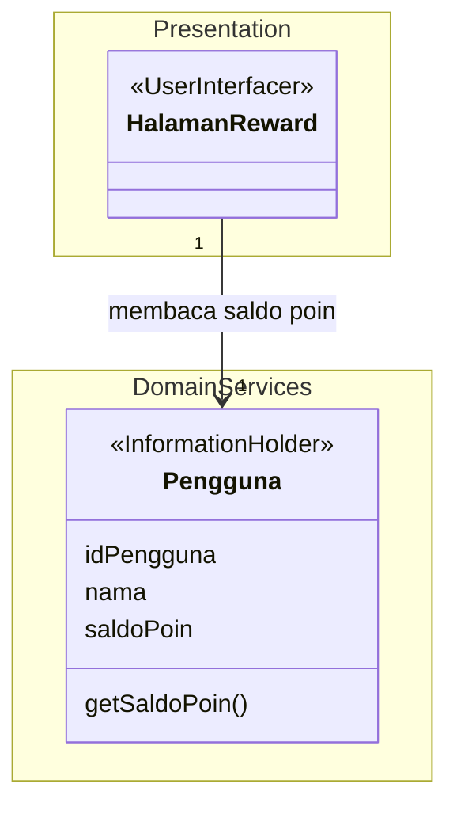

<i>Gambar 8. Diagram Kelas Use Case UC07</i>

| ID Kelas | Nama Kelas | Atribut | Metode/Operasi |
| :--- | :--- | :--- | :--- |
| *C12* | *HalamanReward* | *-* | *tampilkanSaldo(saldo)* |
| *C08* | *Pengguna* | *idPengguna, nama, saldoPoin* | *getSaldoPoin()* |

### 5.2.8 Use Case UC08

**Nama Use Case:** *Melihat Reward yang Tersedia*

#### Identifikasi Kelas

| ID Kelas | Nama Kelas | Deskripsi Kelas |
| :--- | :--- | :--- |
| *C12* | *HalamanReward* | *Menampilkan daftar reward yang tersedia untuk ditukarkan.* |
| *C10* | *DaftarReward* | *Menyimpan kumpulan reward dan menyaring reward yang masih tersedia.* |
| *C09* | *Reward* | *Menyimpan informasi nama, jenis, harga poin, dan stok sebuah reward.* |

#### Diagram Kelas

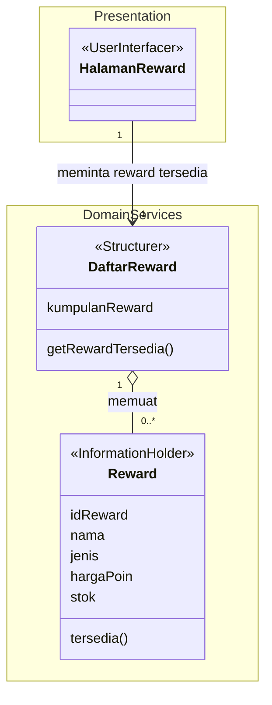

<i>Gambar 9. Diagram Kelas Use Case UC08</i>

| ID Kelas | Nama Kelas | Atribut | Metode/Operasi |
| :--- | :--- | :--- | :--- |
| *C12* | *HalamanReward* | *-* | *tampilkanDaftarReward(daftar)* |
| *C10* | *DaftarReward* | *kumpulanReward* | *getRewardTersedia()* |
| *C09* | *Reward* | *idReward, nama, jenis, hargaPoin, stok* | *tersedia()* |

### 5.2.9 Use Case UC09

**Nama Use Case:** *Menukarkan Poin dengan Reward*

#### Identifikasi Kelas

| ID Kelas | Nama Kelas | Deskripsi Kelas |
| :--- | :--- | :--- |
| *C12* | *HalamanReward* | *Menerima pilihan reward dari pengguna dan menampilkan notifikasi berhasil atau gagalnya penukaran.* |
| *C11* | *ManagerPoin* | *Mengatur jalannya transaksi penukaran: memastikan poin dipotong, stok dikurangi, dan penukaran tercatat sekaligus, atau tidak ada perubahan sama sekali.* |
| *C08* | *Pengguna* | *Menyimpan saldo poin dan memutuskan apakah poinnya cukup untuk suatu harga.* |
| *C09* | *Reward* | *Menyimpan informasi reward dan memutuskan apakah stoknya masih tersedia.* |
| *C13* | *Penukaran* | *Merepresentasikan satu peristiwa penukaran poin dengan reward sebagai bukti klaim pengguna.* |

#### Diagram Kelas

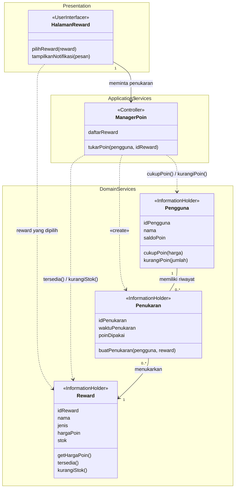

<i>Gambar 10. Diagram Kelas Use Case UC09</i>

| ID Kelas | Nama Kelas | Atribut | Metode/Operasi |
| :--- | :--- | :--- | :--- |
| *C12* | *HalamanReward* | *-* | *pilihReward(reward), tampilkanNotifikasi(pesan)* |
| *C11* | *ManagerPoin* | *-* | *tukarPoin(pengguna, reward)* |
| *C08* | *Pengguna* | *idPengguna, nama, saldoPoin* | *cukupPoin(harga), kurangiPoin(jumlah)* |
| *C09* | *Reward* | *idReward, nama, jenis, hargaPoin, stok* | *getHargaPoin(), tersedia(), kurangiStok()* |
| *C13* | *Penukaran* | *idPenukaran, waktuPenukaran, poinDipakai* | *buatPenukaran(pengguna, reward)* |

<!-- Salin ulang diagram kelas untuk setiap use case dari BAB 4.2 dokumen *Class Diagram*, lengkap dengan tabel atribut dan metode/operasinya.

### 5.2.1 Use Case UC01

**Nama Use Case:** *Memesan Produk*

<i>Gambar 3. Contoh Diagram Kelas Use Case UC01</i>

| ID Kelas | Nama Kelas | Atribut | Metode/Operasi |
| :--- | :--- | :--- | :--- |
| *C02* | *Pesanan* | *idPesanan, total, status* | *buatPesanan(), hitungTotal()* |
| *C03* | *Keranjang* | *daftarItem* | *tambahItem(), checkout()* |
| *...* | *...* | *...* | *...* |

> Lanjutkan pola **5.2.x** untuk setiap use case pada 4.2.-->

## 5.3 Diagram Kelas Keseluruhan

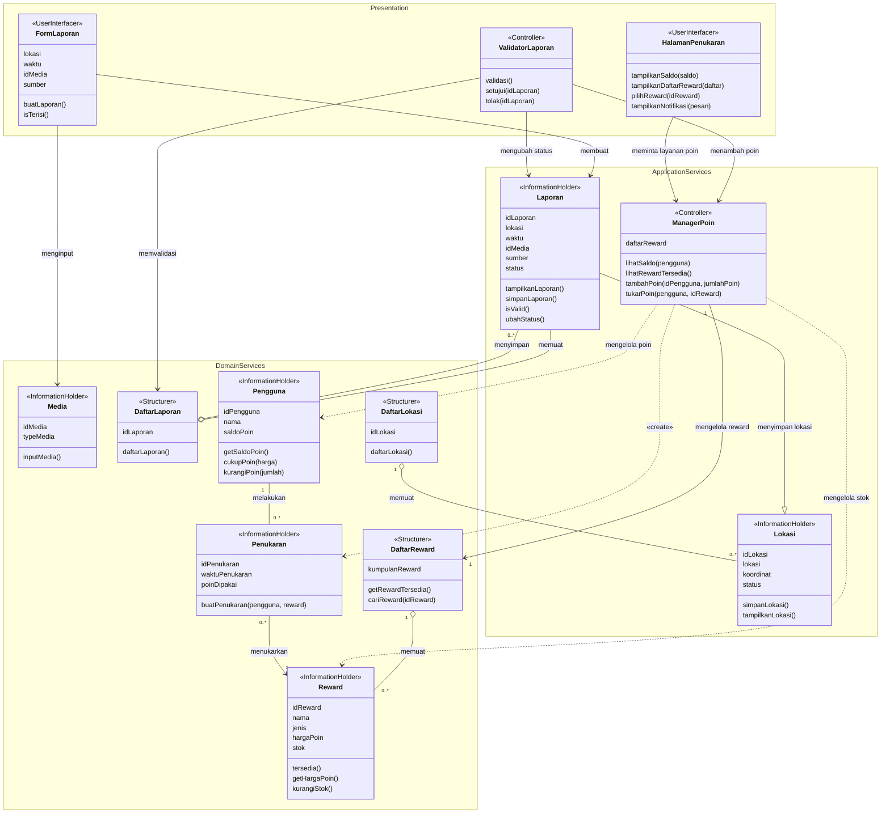

<i>Gambar X. Diagram Kelas Keseluruhan</i>

 

| ID Kelas | Nama Kelas | Atribut | Metode/Operasi |
| :--- | :--- | :--- | :--- |
| *C01* | *FormLaporan* | *lokasi, waktu, idMedia, sumber* | *buatLaporan(), isTerisi()* |
| *C02* | *Laporan* | *idLaporan, lokasi, waktu, idMedia, sumber, status* | *tampilkanLaporan(), simpanLaporan(), isValid(), ubahStatus()* |
| *C03* | *Media* | *idMedia, typeMedia* | *inputMedia()* |
| *C04* | *DaftarLaporan* | *idLaporan* | *daftarLaporan()* |
| *C05* | *ValidatorLaporan* | *-* | *validasi(), setujui(idLaporan), tolak(idLaporan)* |
| *C06* | *Lokasi* | *idLokasi, lokasi, koordinat, status* | *simpanLokasi(), tampilkanLokasi()* |
| *C07* | *DaftarLokasi* | *idLokasi* | *daftarLokasi()* |
| *C08* | *Pengguna* | *idPengguna, nama, saldoPoin* | *getSaldoPoin(), cukupPoin(harga), kurangiPoin(jumlah)* |
| *C09* | *Reward* | *idReward, nama, jenis, hargaPoin, stok* | *tersedia(), getHargaPoin(), kurangiStok()* |
| *C10* | *DaftarReward* | *kumpulanReward* | *getRewardTersedia(), cariReward(idReward)* |
| *C11* | *ManagerPoin* | *daftarReward* | *lihatSaldo(pengguna), lihatRewardTersedia(), tambahPoin(idPengguna, jumlahPoin), tukarPoin(pengguna, idReward)* |
| *C12* | *HalamanPenukaran* | *-* | *tampilkanSaldo(saldo), tampilkanDaftarReward(daftar), pilihReward(idReward), tampilkanNotifikasi(pesan)* |
| *C13* | *Penukaran* | *idPenukaran, waktuPenukaran, poinDipakai* | *buatPenukaran(pengguna, reward)* |

<!-- Gabungkan seluruh kelas dan hubungan antarkelas dari BAB 4.3 dokumen *Class Diagram* menjadi satu diagram kelas keseluruhan. Pastikan tidak ada kelas yang terduplikasi atau tertinggal.

<i>Gambar 4. Contoh Diagram Kelas Keseluruhan</i>

| ID Kelas | Nama Kelas | Atribut | Metode/Operasi |
| :--- | :--- | :--- | :--- |
| *C01* | *Pelanggan* | *idPelanggan, nama, email* | *lihatRiwayatPesanan()* |
| *C02* | *Pesanan* | *idPesanan, total, status* | *hitungTotal(), perbaruiStatus()* |
| *...* | *...* | *...* | *...* | -->

---

# BAB 6: Traceability

| ID Kelas | ID Use Case | ID KF |
| :---| :---| :---|
| C01 | *UC01, UC02, UC05* | *KF01, KF02, KF03, KF04, KF08* |
| C02 | *UC01, UC03, UC05, UC06* | *KF01, KF03, KF04, KF05, KF08, KF09, KF10, KF11* |
| C03 | *UC02* | *KF02* |
| C04 | *UC01, UC03, UC05, UC06* | *KF01, KF03, KF04, KF05, KF08, KF09, KF10, KF11* |
| C05 | *UC03, UC06* | *KF05, KF09, KF10, KF11* |
| C06 | *UC03, UC04* | *KF05, KF06, KF07* |
| C07 | *UC04* | *KF06, KF07* |
| C08 | *UC07, UC09* | *KF11, KF12, KF13* |
| C09 | *UC08, UC09* | *KF11, KF12, KF13* |
| C10 | *UC08, UC09* | *KF11, KF12, KF13* |
| C11 | *UC07, UC08, UC09* | *KF11, KF12, KF13* |
| C12 | *UC07, UC08, UC09* | *KF11, KF12, KF13* |
| C13 | *UC09* | *KF11, KF12, KF13* |

<!-- Salin ulang tabel Traceability dari BAB 5 dokumen *Class Diagram*, cocokkan setiap Kebutuhan Fungsional, Use Case, dan Kelas yang saling terkait.

| ID Kelas | ID Use Case | ID KF |
| :--- | :--- | :--- |
| *C01* | *UC01, UC05* | *KF01, KF06* |
| *C02* | *UC01, UC03, UC05* | *KF01, KF02, KF05, KF06* |
| *C03* | *UC01, UC02* | *KF01, KF02* |
| *...* | *...* | *...* | -->

---

# Referensi
- Diagram UML: [https://www.drawio.com/](https://www.drawio.com/), [https://staruml.io/](https://staruml.io/)
